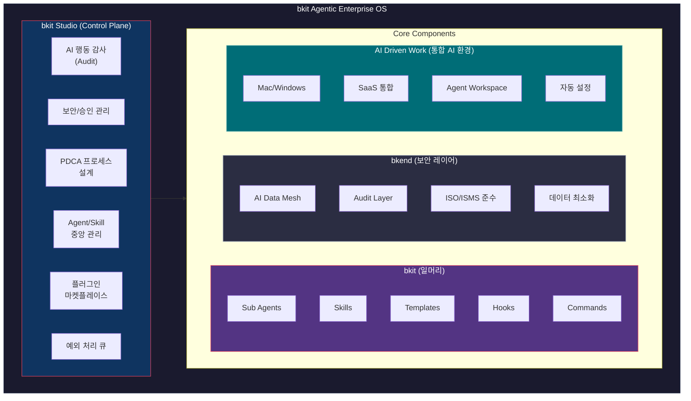
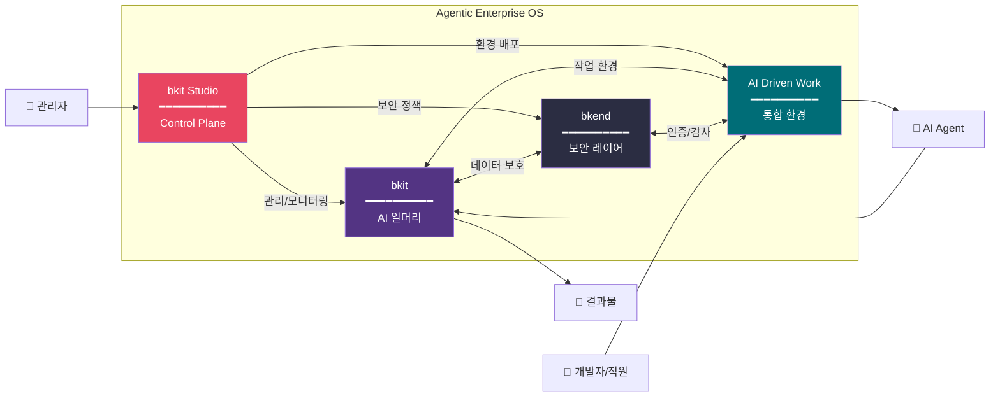

# bkit Enterprise 확장 및 커스터마이징 전략 보고서

> **Version**: 1.0.0
> **Date**: 2026-01-25
> **Author**: Claude Opus 4.5
> **Scope**: bkit Agentic Enterprise OS 비전 및 발전 방향 종합 분석

---

## Executive Summary

본 보고서는 bkit (Vibecoding Kit)의 Enterprise 확장 전략을 종합적으로 분석합니다. 2025-2026년 Agentic AI 시장 트렌드, bkit의 현재 아키텍처, bkit Studio 및 bkit Agentic Enterprise OS의 비전을 바탕으로, 다양한 기업에서 bkit을 재사용하고 커스터마이징할 수 있는 표준화 전략을 제시합니다.

### 핵심 발견사항

| 영역 | 현황 | 전략적 시사점 |
|------|------|---------------|
| **시장 트렌드** | 2026년까지 기업 앱 40%에 AI Agent 탑재 예상 (Gartner) | 선점 기회, 표준화 필수 |
| **bkit 아키텍처** | 11 Agents, 18 Skills, 26 Scripts, 20 Templates | 모듈화 우수, 확장 용이 |
| **bkit Studio 비전** | AI 행동 감사, 보안/승인 관리, PDCA 프로세스 설계 | Enterprise Control Plane |
| **Agentic Enterprise OS** | bkit + bkit Studio + bkend + AI Driven Work | 통합 운영체제 패러다임 |

---

## Part 1: 2025-2026 Enterprise Agentic AI 시장 트렌드

### 1.1 Gartner 예측

```
┌─────────────────────────────────────────────────────────────────┐
│              Gartner Agentic AI Evolution Roadmap               │
├─────────────────────────────────────────────────────────────────┤
│ 2025: 거의 모든 기업 앱에 AI Assistant 탑재 (인간 입력 의존)    │
│ 2026: 기업 앱 40%에 독립적 Agent 통합 (5% → 40% 급성장)        │
│ 2027: 앱 내 Agent들이 협업 시작                                  │
│ 2028: 플랫폼 간 Agent 네트워크 협업, Agentic Frontend 전환      │
│ 2029: 지식 노동자 50% 이상이 Agent 생성/관리/배포 능력 보유     │
├─────────────────────────────────────────────────────────────────┤
│ 🔮 Best Case: 2035년 기업 소프트웨어 매출 30% ($450B+)가       │
│    Agentic AI에서 발생 (2025년 2%에서 급성장)                   │
└─────────────────────────────────────────────────────────────────┘
```

**핵심 지표**:
- Multi-agent 시스템 문의 **1,445% 증가** (Q1 2024 → Q2 2025)
- C-Level 임원들에게 3-6개월 내 Agentic AI 전략 수립 권고

### 1.2 McKinsey 조사 결과

```
┌─────────────────────────────────────────────────────────────────┐
│               McKinsey State of AI 2025                          │
├─────────────────────────────────────────────────────────────────┤
│                                                                 │
│  23% ─┬─ Agentic AI 시스템을 기업 내 확장 중                    │
│       │                                                         │
│  39% ─┼─ AI Agent 실험 단계                                     │
│       │                                                         │
│  38% ─┴─ 아직 시작 안 함                                        │
│                                                                 │
├─────────────────────────────────────────────────────────────────┤
│ ⚡ High Performers는 Agent 확장 가능성 3배 높음                 │
│ 💡 핵심 차별화: AI 모델 정교함 < 워크플로우 재설계 의지         │
│ 📊 "89% 조직이 아직 산업시대 운영 모델"                         │
└─────────────────────────────────────────────────────────────────┘
```

### 1.3 Salesforce/Anthropic/Linux Foundation 동향

#### Salesforce Agentforce 360 & Slack as Agentic OS

| 발표 | 내용 | 시사점 |
|------|------|--------|
| **Dreamforce 2025** | "Slack = Agentic OS for Enterprise" 선언 | 협업 플랫폼이 Agent 허브로 진화 |
| **Anthropic 파트너십** | Claude가 Agentforce 360 기반 모델 | 규제 산업용 신뢰 AI 수요 증가 |
| **MCP 서버** | 3rd party AI 앱을 Slack 실시간 데이터에 연결 | 표준 프로토콜 중요성 대두 |
| **새 Slackbot** | 2026년 1월 GA, Claude 기반 Enterprise AI Assistant | Enterprise AI Assistant 시대 개막 |

#### Agentic AI Foundation (Linux Foundation)

```
┌─────────────────────────────────────────────────────────────────┐
│          Agentic AI Foundation 창립 멤버 (2025.12)              │
├─────────────────────────────────────────────────────────────────┤
│ Anthropic  → MCP (Model Context Protocol) 기부                  │
│ Block      → Goose (오픈소스 Agent 프레임워크) 기부             │
│ OpenAI     → AGENTS.md 기부                                     │
│ Microsoft  → 참여                                               │
│ Google     → 참여                                               │
├─────────────────────────────────────────────────────────────────┤
│ 📌 목적: AI Agent 시대를 위한 오픈소스 도구 및 표준 개발        │
└─────────────────────────────────────────────────────────────────┘
```

### 1.4 핵심 트렌드 요약

| 트렌드 | 설명 | bkit 전략적 시사점 |
|--------|------|-------------------|
| **Agentic OS** | 협업 플랫폼이 AI Agent 실행 환경으로 진화 | bkit Studio = Enterprise Agentic Control Plane |
| **MCP 표준화** | Agent-to-Tool 연결 표준 프로토콜 | bkit MCP 통합 우선 지원 |
| **Human-in-the-Loop** | AI 실행, 인간 승인 모델 | bkit PDCA Check-Act 자동화와 연계 |
| **Regulated AI** | 규제 산업용 신뢰 AI 수요 | bkend 보안 레이어 + Audit Trail |
| **워크플로우 재설계** | AI를 레거시에 덧붙이기 < 근본 재설계 | AI-Native 개발 방법론 차별화 |

---

## Part 2: bkit 현재 아키텍처 분석

### 2.1 컴포넌트 개요 (v1.4.1)

```
┌─────────────────────────────────────────────────────────────────┐
│                 bkit Component Architecture                      │
├─────────────────────────────────────────────────────────────────┤
│                                                                 │
│   ┌──────────────────────────────────────────────────────────┐  │
│   │                    Context Layer                          │  │
│   │  ┌────────────┐  ┌────────────┐  ┌────────────┐         │  │
│   │  │  Skills    │  │  Templates │  │  Agents    │         │  │
│   │  │  (18)      │  │  (20)      │  │  (11)      │         │  │
│   │  └────────────┘  └────────────┘  └────────────┘         │  │
│   └──────────────────────────────────────────────────────────┘  │
│                              │                                  │
│   ┌──────────────────────────┼──────────────────────────────┐  │
│   │                   Automation Layer                       │  │
│   │  ┌────────────┐  ┌────────────┐  ┌────────────┐         │  │
│   │  │  Commands  │  │  Scripts   │  │  Hooks     │         │  │
│   │  │  (21+20)   │  │  (26)      │  │  (3 types) │         │  │
│   │  └────────────┘  └────────────┘  └────────────┘         │  │
│   └──────────────────────────┼──────────────────────────────┘  │
│                              │                                  │
│   ┌──────────────────────────┼──────────────────────────────┐  │
│   │                   Infrastructure Layer                   │  │
│   │  ┌────────────┐  ┌────────────┐  ┌────────────┐         │  │
│   │  │ lib/common │  │ bkit.config│  │  docs/     │         │  │
│   │  │ (76 funcs) │  │  .json     │  │ .pdca-status│        │  │
│   │  └────────────┘  └────────────┘  └────────────┘         │  │
│   └──────────────────────────────────────────────────────────┘  │
│                                                                 │
├─────────────────────────────────────────────────────────────────┤
│              Claude Code        │        Gemini CLI             │
│  ─────────────────────────────────────────────────────────────  │
│  CLAUDE.md + hooks.json        │  GEMINI.md + gemini-extension  │
└─────────────────────────────────────────────────────────────────┘
```

### 2.2 Context Engineering 성숙도 평가

| 기법 | 현재 수준 | 개선 필요 영역 |
|------|-----------|----------------|
| **System Prompts** | ████████████████████ 100% | - |
| **Tool Design** | █████████████████░░░ 85% | MCP 통합 확대 |
| **Few-shot Prompting** | ████████████████░░░░ 80% | 예제 라이브러리화 |
| **Memory Management** | ████████████░░░░░░░░ 60% | Compaction 고도화 |
| **RAG Integration** | ████░░░░░░░░░░░░░░░░ 20% | Vector DB 연동 |
| **Dynamic Context Mgmt** | ██████░░░░░░░░░░░░░░ 30% | 토큰 모니터링 |

### 2.3 PDCA + 9-Phase Pipeline 통합

```
┌─────────────────────────────────────────────────────────────────┐
│          PDCA × 9-Phase Pipeline = AI-Native Development        │
├─────────────────────────────────────────────────────────────────┤
│                                                                 │
│  Phase 1: Schema    ──┐                                        │
│  Phase 2: Convention ─┤── PDCA(Plan → Design → Do → Check → Act)│
│  Phase 3: Mockup    ──┘                                        │
│  ...                                                            │
│  Phase 9: Deploy    ──── PDCA(Plan → Design → Do → Check → Act)│
│                                                                 │
│  핵심: 각 Phase 내에서 PDCA 사이클 반복                         │
│                                                                 │
├─────────────────────────────────────────────────────────────────┤
│ Level별 Phase 적용:                                              │
│ • Starter:    1 → 2 → 3 → 6 → 9 (5 phases)                      │
│ • Dynamic:    1 → 2 → 3 → 4 → 5 → 6 → 7 → 9 (8 phases)          │
│ • Enterprise: 1 → 2 → 3 → 4 → 5 → 6 → 7 → 8 → 9 (All 9 phases)  │
└─────────────────────────────────────────────────────────────────┘
```

---

## Part 3: bkit Studio & bkit Agentic Enterprise OS 비전

### 3.1 bkit Agentic Enterprise OS 정의



**구성요소 관계도**:



### 3.2 bkit Studio 핵심 기능

| 기능 | 설명 | Enterprise 가치 |
|------|------|-----------------|
| **AI 행동 감사** | 모든 Agent 활동 로깅 및 분석 | 컴플라이언스, 책임 추적 |
| **보안/승인 관리** | Human-in-the-Loop 승인 워크플로우 | 위험 완화, 통제력 확보 |
| **PDCA 프로세스 설계** | 기업별 PDCA 커스터마이징 | 기존 프로세스와 통합 |
| **Agent/Skill 관리** | 중앙 집중식 등록/배포/버전관리 | 일관성, 거버넌스 |
| **데이터 모니터링** | AI 데이터 흐름 가시화 | 보안, 최적화 |
| **AI 워크로드 분석** | 사용량, 비용, 성과 대시보드 | ROI 측정, 예산 관리 |
| **플러그인 마켓플레이스** | 기업 간 Agent/Skill 공유 | 생태계 확장 |
| **예외 처리 큐** | AI 실패 케이스 수동 처리 | 품질 보증 |

### 3.3 7단계 도입 로드맵 (PDF 기반)

```
┌─────────────────────────────────────────────────────────────────┐
│            bkit Agentic Enterprise OS 도입 7단계                 │
├─────────────────────────────────────────────────────────────────┤
│                                                                 │
│  Step 1: 설치 및 환경 구성                                      │
│          └─ bkit 플러그인 + bkend 연동                          │
│                     ↓                                           │
│  Step 2: 초기 Agent/Skill 세트 구성                             │
│          └─ 부서별 필요 기능 매핑                               │
│                     ↓                                           │
│  Step 3: PDCA 프로세스 커스터마이징                              │
│          └─ 기업 기존 워크플로우와 통합                         │
│                     ↓                                           │
│  Step 4: 파일럿 팀 운영                                         │
│          └─ 소규모 팀에서 검증                                  │
│                     ↓                                           │
│  Step 5: 피드백 반영 및 최적화                                   │
│          └─ 사용 패턴 분석, 개선                                │
│                     ↓                                           │
│  Step 6: 전사 확산                                               │
│          └─ 점진적 롤아웃                                        │
│                     ↓                                           │
│  Step 7: 지속적 개선 및 확장                                     │
│          └─ 마켓플레이스 활용, 신규 Agent 개발                   │
│                                                                 │
└─────────────────────────────────────────────────────────────────┘
```

---

## Part 4: Enterprise 확장을 위한 표준화 전략

### 4.1 현재 bkit의 표준화 수준

| 영역 | 현재 상태 | 표준화 필요 사항 |
|------|-----------|------------------|
| **Agent 정의** | 11개 고정 | Agent Registry + 버전 관리 |
| **Skill 정의** | 18개 고정 | Skill Marketplace + 의존성 관리 |
| **Template** | 20개 고정 | Template Engine + 변수 시스템 |
| **Hook** | 3 이벤트 타입 | Hook Pipeline + 조건부 실행 |
| **Config** | bkit.config.json | Multi-tenant Config + Override 계층 |

### 4.2 표준화 프레임워크 제안

#### 4.2.1 계층적 구성 시스템

```
┌─────────────────────────────────────────────────────────────────┐
│              Configuration Hierarchy (제안)                      │
├─────────────────────────────────────────────────────────────────┤
│                                                                 │
│  Level 1: bkit-core.config.json (bkit 기본 설정, 수정 불가)     │
│                     ↓ 상속                                      │
│  Level 2: bkit-enterprise.config.json (Enterprise 공통)         │
│                     ↓ 상속                                      │
│  Level 3: bkit-{company}.config.json (기업별 커스터마이징)       │
│                     ↓ 상속                                      │
│  Level 4: bkit-{project}.config.json (프로젝트별 설정)           │
│                     ↓ 상속                                      │
│  Level 5: .bkit-local.config.json (개인 로컬 설정)               │
│                                                                 │
│  하위 레벨이 상위 레벨 설정을 Override                           │
└─────────────────────────────────────────────────────────────────┘
```

#### 4.2.2 Agent Registry 표준

```yaml
# 제안: agents/registry.yaml
registry:
  version: "1.0.0"
  agents:
    - id: "gap-detector"
      version: "1.4.1"
      category: "analysis"
      model: "opus"
      tier: "core"  # core | enterprise | custom
      dependencies:
        skills: ["bkit-templates"]
        scripts: ["gap-detector-stop.js"]

    - id: "custom-compliance-checker"
      version: "1.0.0"
      category: "analysis"
      model: "sonnet"
      tier: "custom"
      author: "company-name"
      certified: true
```

#### 4.2.3 Skill Marketplace 구조

```
┌─────────────────────────────────────────────────────────────────┐
│                    Skill Marketplace 구조                        │
├─────────────────────────────────────────────────────────────────┤
│                                                                 │
│  Core Skills (bkit 제공)                                        │
│  ├── bkit-rules (필수)                                          │
│  ├── bkit-templates (필수)                                      │
│  └── development-pipeline                                       │
│                                                                 │
│  Industry Skills (산업별)                                        │
│  ├── fintech/ (금융)                                            │
│  │   ├── compliance-check                                       │
│  │   └── risk-assessment                                        │
│  ├── healthcare/ (헬스케어)                                      │
│  │   ├── hipaa-compliance                                       │
│  │   └── clinical-documentation                                 │
│  └── ecommerce/ (이커머스)                                       │
│      ├── inventory-management                                   │
│      └── order-processing                                       │
│                                                                 │
│  Company Skills (기업 자체 개발)                                 │
│  └── {company-name}/                                            │
│      ├── internal-process-a                                     │
│      └── internal-process-b                                     │
│                                                                 │
└─────────────────────────────────────────────────────────────────┘
```

### 4.3 커스터마이징 가이드

#### 4.3.1 기업별 PDCA 커스터마이징

| 커스터마이징 포인트 | 방법 | 예시 |
|---------------------|------|------|
| **Phase 이름 변경** | bkit-{company}.config.json | "Design" → "Specification" |
| **Phase 추가/제거** | pipeline 설정 | 법률 검토 Phase 추가 |
| **문서 경로 변경** | docs 경로 설정 | docs/ → specifications/ |
| **승인 워크플로우** | Hook 추가 | 매니저 승인 필수 |
| **템플릿 커스터마이징** | 템플릿 오버라이드 | 기업 브랜딩 적용 |

#### 4.3.2 Agent 커스터마이징 예시

```markdown
# 예시: 금융사 Compliance Agent

---
name: compliance-checker
model: opus  # 높은 정확도 필요
description: |
  금융규제 준수 여부를 검증하는 Agent.

  사용: 코드 변경 시 자동 호출

  Triggers: compliance, 규제, 준수, 컴플라이언스

  Do NOT use for: 일반 코드 리뷰
allowed-tools:
  - Read
  - Grep
  - Glob
  # Write 제외 (읽기 전용)
hooks:
  PreToolUse:
    - matcher: "Write|Edit"
      script: "./scripts/compliance-pre-check.js"
---

## 검증 항목

1. PII(개인식별정보) 노출 여부
2. 암호화 표준 준수 (AES-256)
3. 로깅 규정 준수
4. 데이터 보존 정책 준수

## 출력 형식

| 항목 | 상태 | 근거 조항 |
|------|------|-----------|
| PII 검사 | ✅/❌ | GDPR Art.5 |
| 암호화 | ✅/❌ | PCI-DSS Req.3 |
```

### 4.4 Multi-tenant 지원 전략

```
┌─────────────────────────────────────────────────────────────────┐
│                Multi-tenant Architecture                         │
├─────────────────────────────────────────────────────────────────┤
│                                                                 │
│                      bkit Studio                                │
│                          │                                      │
│         ┌────────────────┼────────────────┐                     │
│         ▼                ▼                ▼                     │
│   ┌──────────┐    ┌──────────┐    ┌──────────┐                 │
│   │ Tenant A │    │ Tenant B │    │ Tenant C │                 │
│   │ (금융사) │    │ (헬스케어)│    │ (제조업) │                 │
│   ├──────────┤    ├──────────┤    ├──────────┤                 │
│   │• Custom  │    │• Custom  │    │• Custom  │                 │
│   │  Skills  │    │  Skills  │    │  Skills  │                 │
│   │• Config  │    │• Config  │    │• Config  │                 │
│   │• Agents  │    │• Agents  │    │• Agents  │                 │
│   └──────────┘    └──────────┘    └──────────┘                 │
│         │                │                │                     │
│         └────────────────┼────────────────┘                     │
│                          ▼                                      │
│                    Shared Core                                  │
│   ┌──────────────────────────────────────────────────────────┐  │
│   │  bkit-rules │ bkit-templates │ lib/common │ PDCA Core   │  │
│   └──────────────────────────────────────────────────────────┘  │
│                                                                 │
└─────────────────────────────────────────────────────────────────┘
```

---

## Part 5: 제안하는 표준화된 기능 세트

### 5.1 Core Tier (모든 기업 필수)

| 기능 | 설명 | 현재 상태 |
|------|------|-----------|
| **PDCA Workflow** | Plan-Design-Do-Check-Act 자동화 | ✅ 구현됨 |
| **Gap Analysis** | 설계-구현 일치도 검증 | ✅ 구현됨 |
| **Session Onboarding** | 세션 시작 시 컨텍스트 로딩 | ✅ 구현됨 |
| **Multi-language Triggers** | 8개 언어 키워드 지원 | ✅ 구현됨 |
| **Level Detection** | Starter/Dynamic/Enterprise 자동 감지 | ✅ 구현됨 |
| **Document Templates** | PDCA 문서 자동 생성 | ✅ 구현됨 |

### 5.2 Enterprise Tier (대기업/규제 산업)

| 기능 | 설명 | 현재 상태 | 구현 제안 |
|------|------|-----------|-----------|
| **Audit Trail** | 모든 AI 활동 로깅 | ⚠️ 부분 | bkit Studio 통합 |
| **Approval Workflow** | 중요 작업 승인 큐 | ❌ 미구현 | Hook 확장 |
| **Role-based Access** | 역할별 Agent/Skill 접근 제어 | ❌ 미구현 | Config 계층 |
| **Compliance Checks** | 규제 준수 자동 검증 | ❌ 미구현 | 산업별 Agent |
| **Cost Tracking** | 토큰 사용량/비용 추적 | ❌ 미구현 | lib/common 확장 |
| **SLA Monitoring** | AI 응답 시간/품질 모니터링 | ❌ 미구현 | Metrics 시스템 |

### 5.3 Industry-specific Tier (산업별 특화)

```
┌─────────────────────────────────────────────────────────────────┐
│                  Industry-specific Features                      │
├─────────────┬───────────────────────────────────────────────────┤
│ 금융        │ • PCI-DSS 준수 검사                               │
│ (Fintech)   │ • 거래 로직 감사                                  │
│             │ • 리스크 평가 Agent                               │
├─────────────┼───────────────────────────────────────────────────┤
│ 헬스케어    │ • HIPAA 준수 검사                                 │
│ (Healthcare)│ • PHI(보호건강정보) 탐지                          │
│             │ • 임상 문서 표준화                                │
├─────────────┼───────────────────────────────────────────────────┤
│ 제조업      │ • IIoT 프로토콜 지원                              │
│ (Manufacturing)│ • 품질 관리 PDCA                               │
│             │ • 설비 데이터 통합                                │
├─────────────┼───────────────────────────────────────────────────┤
│ 공공        │ • FedRAMP 준수                                    │
│ (Government)│ • 보안 등급별 데이터 처리                         │
│             │ • 감사 보고서 자동화                              │
└─────────────┴───────────────────────────────────────────────────┘
```

---

## Part 6: 기술 로드맵

### 6.1 단기 (2026 Q1-Q2)

```
┌─────────────────────────────────────────────────────────────────┐
│                 Phase 1: Foundation (Q1-Q2 2026)                 │
├─────────────────────────────────────────────────────────────────┤
│                                                                 │
│  1. Config 계층 시스템 구현                                      │
│     └─ Multi-level configuration inheritance                    │
│                                                                 │
│  2. Agent/Skill Registry 표준화                                  │
│     └─ 버전 관리, 의존성 해결                                    │
│                                                                 │
│  3. Token 사용량 추적                                            │
│     └─ lib/common.js 확장                                       │
│                                                                 │
│  4. 기본 Audit Trail                                             │
│     └─ 파일 기반 로깅                                            │
│                                                                 │
│  5. MCP 통합 강화                                                │
│     └─ Anthropic MCP 표준 완전 지원                              │
│                                                                 │
└─────────────────────────────────────────────────────────────────┘
```

### 6.2 중기 (2026 Q3-Q4)

```
┌─────────────────────────────────────────────────────────────────┐
│                 Phase 2: Enterprise (Q3-Q4 2026)                 │
├─────────────────────────────────────────────────────────────────┤
│                                                                 │
│  1. bkit Studio MVP                                              │
│     └─ 웹 기반 관리 콘솔                                         │
│                                                                 │
│  2. Approval Workflow Engine                                     │
│     └─ 중요 작업 승인 큐                                         │
│                                                                 │
│  3. RAG 시스템 통합                                              │
│     └─ Vector DB 연동, 시맨틱 검색                               │
│                                                                 │
│  4. 산업별 Skill Pack 출시                                       │
│     └─ Fintech, Healthcare 초기 버전                             │
│                                                                 │
│  5. Multi-tenant 지원                                            │
│     └─ 테넌트 격리, 리소스 관리                                  │
│                                                                 │
└─────────────────────────────────────────────────────────────────┘
```

### 6.3 장기 (2027+)

```
┌─────────────────────────────────────────────────────────────────┐
│                 Phase 3: Ecosystem (2027+)                       │
├─────────────────────────────────────────────────────────────────┤
│                                                                 │
│  1. Skill Marketplace 오픈                                       │
│     └─ 3rd party 개발자 참여                                     │
│                                                                 │
│  2. Multi-Agent Orchestration                                    │
│     └─ Agent 간 협업 워크플로우                                  │
│                                                                 │
│  3. AI Driven Work 통합                                          │
│     └─ Mac/Windows 네이티브 앱                                   │
│                                                                 │
│  4. bkend 완전 통합                                              │
│     └─ Enterprise AI Data Mesh                                   │
│                                                                 │
│  5. Agentic AI Foundation 표준 준수                              │
│     └─ MCP, AGENTS.md, Goose 호환                                │
│                                                                 │
└─────────────────────────────────────────────────────────────────┘
```

---

## Part 7: Claude의 객관적 의견

### 7.1 bkit의 강점

1. **PDCA 방법론의 체계화**: bkit은 AI-Native 개발에서 흔히 놓치는 "문서화"와 "검증"을 자동화합니다. 대부분의 AI 코딩 도구가 코드 생성에만 집중하는 반면, bkit은 설계-구현-검증 전체 사이클을 관리합니다.

2. **Dual Platform 지원**: Claude Code와 Gemini CLI를 동시에 지원하는 것은 현명한 전략입니다. 특정 벤더 종속을 피하면서 더 넓은 사용자 기반을 확보할 수 있습니다.

3. **다국어 트리거 시스템**: 8개 언어 지원은 글로벌 기업 확장에 핵심적입니다. 한국어, 일본어, 중국어, 유럽 언어를 모두 지원하는 것은 경쟁 우위입니다.

4. **모듈화된 아키텍처**: 76개 유틸리티 함수, 11개 Agent, 18개 Skill의 분리된 구조는 커스터마이징과 확장에 유리합니다.

### 7.2 개선이 필요한 영역

1. **RAG 시스템 부재**: 대규모 코드베이스에서 Context Engineering의 핵심인 "관련 정보 검색"이 현재 Glob/Grep에 의존합니다. Vector DB 기반 시맨틱 검색이 필요합니다.

2. **동적 컨텍스트 관리 미흡**: 토큰 사용량 추적과 자동 Compaction이 없어 긴 세션에서 성능 저하가 발생할 수 있습니다.

3. **Enterprise 기능 격차**: Audit Trail, 승인 워크플로우, 역할 기반 접근 제어 등 Enterprise 필수 기능이 아직 구현되지 않았습니다.

4. **테스트 커버리지 부족**: 26개 스크립트에 대한 단위 테스트가 없어 리팩토링 시 회귀 위험이 있습니다.

### 7.3 전략적 권고사항

```
┌─────────────────────────────────────────────────────────────────┐
│                    전략적 권고사항 요약                           │
├─────────────────────────────────────────────────────────────────┤
│                                                                 │
│  1. 🎯 시장 타이밍 활용                                          │
│     • Gartner 예측 (2026년 40% Agent 앱)에 맞춰 Enterprise 버전  │
│       출시 준비                                                  │
│     • Salesforce/Anthropic처럼 규제 산업 집중 공략               │
│                                                                 │
│  2. 🔧 기술 우선순위                                             │
│     • RAG 시스템 > 동적 컨텍스트 관리 > Approval Workflow         │
│     • MCP 표준 완전 준수로 Agentic AI Foundation 호환 확보       │
│                                                                 │
│  3. 💼 비즈니스 모델                                             │
│     • Core (무료) + Enterprise (유료) + Industry Pack (유료)      │
│     • Skill Marketplace 수수료 모델                              │
│                                                                 │
│  4. 🤝 파트너십                                                  │
│     • bkend 통합 강화로 Full-stack 제안                          │
│     • SI 파트너사 통한 Enterprise 도입 지원                       │
│                                                                 │
│  5. ⚠️ 리스크 관리                                               │
│     • AI 규제 변화 모니터링 (EU AI Act 등)                       │
│     • 경쟁 도구 (Cursor, Windsurf) 차별화 포인트 유지            │
│                                                                 │
└─────────────────────────────────────────────────────────────────┘
```

### 7.4 최종 평가

bkit Agentic Enterprise OS의 비전은 **시의적절**합니다. 2025-2026년은 Gartner가 예측한 "Agentic AI 대중화"의 전환점이며, McKinsey가 지적한 "워크플로우 재설계"가 핵심 성공 요인입니다.

bkit의 **PDCA 방법론**은 단순 AI 코딩 도구를 넘어 **"AI가 일하고 인간이 승인하는" Agentic Organization**의 운영 체제로 진화할 잠재력이 있습니다.

다만, 현재 **Context Engineering 성숙도 70%** 수준에서 Enterprise 시장 진입을 위해서는 RAG 통합, Audit Trail, 승인 워크플로우 등 핵심 기능의 빠른 구현이 필요합니다.

**Salesforce의 Slack이 "Agentic OS for Enterprise"를 선언한 것처럼, bkit은 "개발 조직을 위한 Agentic OS"로 포지셔닝할 명확한 기회가 있습니다.**

---

## 참고 자료

### Market Research
- [Gartner: 40% Enterprise Apps with AI Agents by 2026](https://www.gartner.com/en/newsroom/press-releases/2025-08-26-gartner-predicts-40-percent-of-enterprise-apps-will-feature-task-specific-ai-agents-by-2026-up-from-less-than-5-percent-in-2025)
- [McKinsey: The State of AI in 2025](https://www.mckinsey.com/capabilities/quantumblack/our-insights/the-state-of-ai)
- [Salesforce Agentforce 360 Announcement](https://www.salesforce.com/news/press-releases/2025/10/13/agentic-enterprise-announcement/)
- [Anthropic-Salesforce Partnership for Regulated Industries](https://www.salesforce.com/ap/news/press-releases/2025/10/16/anthropic-regulated-industries-partnership-expansion-announcement/)
- [Agentic AI Foundation (Linux Foundation)](https://techcrunch.com/2025/12/09/openai-anthropic-and-block-join-new-linux-foundation-effort-to-standardize-the-ai-agent-era/)
- [Slack as Agentic OS](https://aibusiness.com/agentic-ai/salesforce-angles-slack-agentic-os-for-enterprise)

### bkit 내부 문서
- [bkit Context Engineering Analysis](./bkit-context-engineering-analysis.md)
- [bkit System Architecture](../bkit-system/README.md)
- [bkit Philosophy - Core Mission](../bkit-system/philosophy/core-mission.md)
- [bkit Philosophy - AI Native Principles](../bkit-system/philosophy/ai-native-principles.md)
- [99-Bkit-Agentic-Enterprise-OS-and-bkit-Studio.pdf](./99-Bkit-Agentic-Enterprise-OS-and-bkit-Studio.pdf)

---

> **Document Version**: 1.0.0
> **Last Updated**: 2026-01-25
> **Generated by**: Claude Opus 4.5 with bkit plugin
> **PDCA Phase**: Report (Act)
