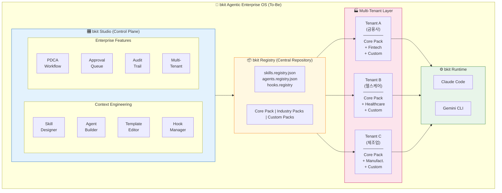
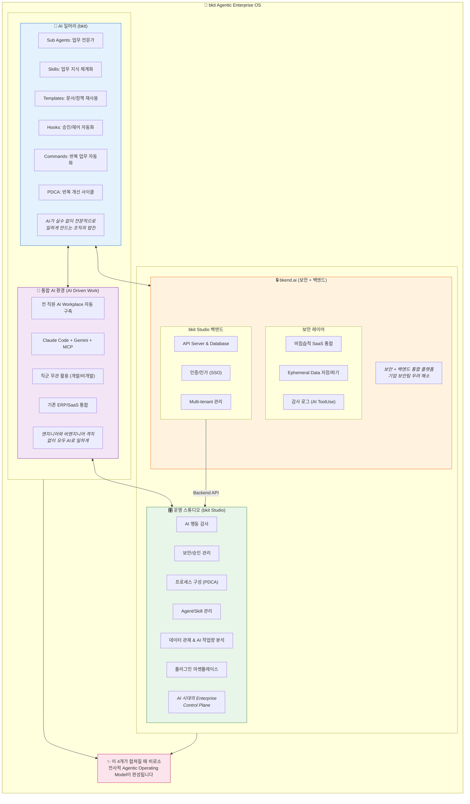

# bkit Agentic Enterprise OS & bkit Studio 고도화 계획서

> **Feature**: bkit-enterprise-studio
> **Version**: 2.0.0
> **Date**: 2026-01-28
> **Author**: Claude Opus 4.5 with bkit plugin
> **PDCA Phase**: Plan
> **Target Audience**: CTO, Enterprise Architect, Product Manager, CISO
> **Reference**: 99-Bkit-Agentic-Enterprise-OS-and-bkit-Studio.pdf (사업계획서)

---

## Executive Summary

> **핵심 공식**: `bkit Agentic Enterprise OS = bkit Studio + bkit + bkend + AI Driven Work`

Gartner가 예측한 **2026년 40% Enterprise 앱에 AI Agent 탑재** 시장에서, bkit Enterprise는 **"AI로 기업이 일하는 방식을 재설계하는 Work OS"**로 포지셔닝합니다. 본 계획서는 bkit을 **Enterprise-grade Context Engineering Platform**으로 고도화하고, **bkit Studio**라는 GUI 기반 관리 도구를 통해 **개발자와 비개발자 모두** 맞춤형 AI-Native 업무 환경을 빠르고 쉽게 구축할 수 있도록 하는 전략을 제시합니다.

### 4대 구성요소

| 구성요소 | 역할 | 핵심 가치 |
|----------|------|-----------|
| **bkit** (AI 일머리) | Sub Agents, Skills, Templates, Hooks, Commands, PDCA | AI가 실수 없이 전문적으로 일하게 만드는 조직의 법전 |
| **bkend** (보안 + 백엔드) | **보안**: Ephemeral 데이터, 감사 로그, SaaS 연동 / **백엔드**: bkit Studio API, DB, 인증, Multi-tenant | 보안과 백엔드 통합 플랫폼 |
| **AI Driven Work** | 전 직원 AI Workplace 자동 구축, SaaS 통합 | 엔지니어와 비엔지니어 격차 없이 모두 AI로 일하게 |
| **bkit Studio** | 전사 AI 활동 통제/감사 중앙 관리 시스템 | AI 시대의 Enterprise Control Plane |

### 핵심 목표

| 목표 | 설명 | 성공 지표 |
|------|------|-----------|
| **Context Engineering 모듈화** | Skills, Agents, Hooks, Templates를 독립적으로 구성/배포 가능하게 | 모듈 간 의존성 0% (완전 분리) |
| **bkit Studio MVP** | GUI 기반 Context Engineering 설정 도구 | 비개발자도 30분 내 커스텀 bkit 구성 |
| **Enterprise 맞춤화** | 산업별/기업별 bkit 패키지 빠른 배포 | 신규 기업 온보딩 < 12주 |
| **Multi-tenant 지원** | 단일 bkit Studio로 다수 기업 관리 | 테넌트 간 완전 격리 |
| **비개발 직무 지원** | 마케팅/영업/HR/재무 등 직무별 Skills/Agents | 전 직군 AI 활용률 100% |
| **bkend 보안 통합** | Ephemeral 데이터, 감사 로그, ISO/ISMS 준수 | 보안팀 승인 획득 |

---

## Part 1: 현재 상태 분석 (As-Is)

### 1.1 bkit v1.4.6 아키텍처 현황

```mermaid
flowchart TB
    subgraph BKIT["🏗️ bkit v1.4.6 Current Architecture"]
        subgraph CONTEXT["📚 Context Layer (정적 정의)"]
            SKILLS["Skills<br/>(21개)<br/>.md files"]
            TEMPLATES["Templates<br/>(20개)<br/>.md files"]
            AGENTS["Agents<br/>(11개)<br/>.md files"]
        end

        subgraph AUTOMATION["⚡ Automation Layer (이벤트 기반)"]
            HOOKS["Hooks<br/>(6 types)<br/>hooks.json"]
            SCRIPTS["Scripts<br/>(39개)<br/>.js"]
            COMMANDS["Commands<br/>(21+20)<br/>.md"]
        end

        subgraph INFRA["🔧 Infrastructure Layer (핵심 로직)"]
            COMMON["lib/common.js (3,240줄)<br/>~95개 함수: 플랫폼 감지, PDCA 관리,<br/>캐싱, 의도 감지, 다국어 트리거"]
            ORCHESTR["skill-orchestrator"]
            RESOLVER["import-resolver"]
            MEMORY["memory-store"]
        end

        subgraph HOST["🖥️ Host Platform"]
            CLAUDE["Claude Code<br/>(CLAUDE.md)"]
            GEMINI["Gemini CLI<br/>(GEMINI.md)"]
        end
    end

    CONTEXT --> AUTOMATION
    AUTOMATION --> INFRA
    INFRA --> HOST

    style CONTEXT fill:#e1f5fe,stroke:#01579b
    style AUTOMATION fill:#fff3e0,stroke:#e65100
    style INFRA fill:#f3e5f5,stroke:#7b1fa2
    style HOST fill:#e8f5e9,stroke:#2e7d32
```



### 1.2 lib/common.js 함수 분류 (95개)

| 카테고리 | 함수 수 | 주요 함수 | 모듈화 우선순위 |
|----------|---------|-----------|-----------------|
| **Platform Detection** | 8 | detectPlatform, isClaudeCode, isGeminiCli | Medium |
| **PDCA Management** | 18 | updatePdcaStatus, getPdcaStatusFull, autoAdvancePdcaPhase | High |
| **Intent Detection** | 6 | matchImplicitAgentTrigger, matchImplicitSkillTrigger | High |
| **Multi-language Triggers** | 4 | 8개 언어 키워드 매칭 | Medium |
| **Ambiguity Analysis** | 8 | calculateAmbiguityScore, generateClarifyingQuestions | Medium |
| **Task System** | 12 | autoCreatePdcaTask, generatePdcaTaskSubject | High |
| **Level/Phase Detection** | 14 | detectLevel, canSkipPhase, getRequiredPhases | High |
| **Cache System** | 4 | _cache.get, _cache.set, _cache.invalidate | Low |
| **I/O Helpers** | 8 | readStdin, parseHookInput, outputAllow | Low |
| **Debug/Logging** | 3 | debugLog, getDebugLogPath | Low |
| **Skill/Agent Tracking** | 10 | setActiveSkill, setActiveAgent, clearActiveContext | High |

### 1.3 Context Engineering 성숙도 (v1.4.6)

```
┌─────────────────────────────────────────────────────────────────┐
│           bkit Context Engineering 성숙도 (v1.4.6)               │
├─────────────────────────┬───────────────────────────────────────┤
│ System Prompts          │ ████████████████████ 100%            │
│ Tool Design             │ █████████████████░░░  85%            │
│ Few-shot Prompting      │ ████████████████░░░░  80%            │
│ Memory Management       │ ████████████████░░░░  80%            │
│ RAG Integration         │ ████░░░░░░░░░░░░░░░░  20%            │
│ Dynamic Context Mgmt    │ ████████████░░░░░░░░  60%            │
│ Multi-language Support  │ ████████████████████ 100%            │
├─────────────────────────┼───────────────────────────────────────┤
│ Overall Maturity        │ ██████████████████░░  80%            │
└─────────────────────────┴───────────────────────────────────────┘
```

### 1.4 현재 한계점

| 영역 | 한계 | Enterprise 영향 |
|------|------|-----------------|
| **정적 구성** | Skills/Agents가 파일 기반으로 고정 | 기업별 커스터마이징 어려움 |
| **단일 테넌트** | 프로젝트 단위 설정만 지원 | 다수 기업 관리 불가 |
| **GUI 부재** | CLI/파일 편집만 가능 | 비개발자 사용 불가 |
| **Audit Trail 미흡** | 기본적인 로깅만 존재 | 컴플라이언스 미충족 |
| **승인 워크플로우 없음** | Human-in-the-Loop 미지원 | 규제 산업 적용 불가 |
| **lib 집중화** | common.js에 모든 로직 집중 | 테스트/유지보수 어려움 |

---

## Part 2: 목표 상태 (To-Be)

### 2.1 bkit Enterprise Architecture



### 2.2 Context Engineering 모듈화 구조

```
┌─────────────────────────────────────────────────────────────────┐
│            Context Engineering Module Architecture               │
├─────────────────────────────────────────────────────────────────┤
│                                                                 │
│  ┌─────────────────────────────────────────────────────────┐   │
│  │                 @bkit/core (필수 패키지)                  │   │
│  │  ├── platform-detector   (플랫폼 감지)                   │   │
│  │  ├── cache-manager       (캐싱 시스템)                   │   │
│  │  ├── io-helpers          (입출력 유틸)                   │   │
│  │  └── debug-logger        (디버그 로깅)                   │   │
│  └─────────────────────────────────────────────────────────┘   │
│                              │                                  │
│  ┌─────────────────────────────────────────────────────────┐   │
│  │                @bkit/pdca (PDCA 엔진)                     │   │
│  │  ├── pdca-status-manager  (상태 관리)                    │   │
│  │  ├── phase-transition     (단계 전환)                    │   │
│  │  ├── task-integration     (Task 시스템)                  │   │
│  │  └── gap-analyzer         (Gap 분석)                     │   │
│  └─────────────────────────────────────────────────────────┘   │
│                              │                                  │
│  ┌─────────────────────────────────────────────────────────┐   │
│  │                @bkit/context (컨텍스트 관리)              │   │
│  │  ├── intent-detector      (의도 감지)                    │   │
│  │  ├── trigger-matcher      (8개 언어 트리거)              │   │
│  │  ├── ambiguity-analyzer   (모호성 분석)                  │   │
│  │  └── level-detector       (레벨 감지)                    │   │
│  └─────────────────────────────────────────────────────────┘   │
│                              │                                  │
│  ┌─────────────────────────────────────────────────────────┐   │
│  │               @bkit/orchestrator (오케스트레이션)         │   │
│  │  ├── skill-orchestrator   (스킬 관리)                    │   │
│  │  ├── agent-orchestrator   (에이전트 관리)                │   │
│  │  ├── hook-orchestrator    (훅 관리)                      │   │
│  │  └── template-resolver    (템플릿 해결)                  │   │
│  └─────────────────────────────────────────────────────────┘   │
│                              │                                  │
│  ┌─────────────────────────────────────────────────────────┐   │
│  │              @bkit/enterprise (Enterprise 기능)           │   │
│  │  ├── audit-trail          (감사 추적)                    │   │
│  │  ├── approval-workflow    (승인 워크플로우)              │   │
│  │  ├── multi-tenant         (다중 테넌트)                  │   │
│  │  └── compliance-checker   (컴플라이언스)                 │   │
│  └─────────────────────────────────────────────────────────┘   │
│                                                                 │
└─────────────────────────────────────────────────────────────────┘
```

### 2.3 bkit Studio 핵심 기능

| 기능 | 설명 | 기술 구현 |
|------|------|-----------|
| **Skill Designer** | 드래그앤드롭으로 스킬 생성/편집 | React + Monaco Editor |
| **Agent Builder** | 에이전트 역할/도구/모델 시각적 설정 | React Flow (노드 기반) |
| **Template Editor** | PDCA 문서 템플릿 커스터마이징 | Markdown Live Preview |
| **Hook Manager** | 이벤트-액션 매핑 시각화 | Pipeline Visualization |
| **Script Editor** | Hook에서 호출하는 Node.js 스크립트 GUI 편집 | Monaco + Node.js Runtime |
| **Context Orchestrator** | Skills↔Agents↔Hooks 연동 시각화/설정 | React Flow + D3.js |
| **PDCA Workflow Designer** | 기업별 PDCA 프로세스 설계 | BPMN.js 기반 |
| **Approval Queue** | Human-in-the-Loop 승인 관리 | WebSocket Real-time |
| **Audit Dashboard** | AI 활동 로그 분석/시각화 | Grafana/ElasticSearch |
| **Tenant Manager** | 기업/팀/프로젝트 계층 관리 | RBAC (Role-Based Access) |

### 2.4 Context Engineering Orchestration (핵심 GUI)

bkit Studio의 핵심 가치는 **Skills, Agents, Hooks, Scripts 간의 연동을 시각적으로 설계하고 관리**하는 것입니다.

#### 2.4.1 연동 관계도

```
┌─────────────────────────────────────────────────────────────────────────────┐
│              bkit Studio: Context Engineering Orchestration                  │
├─────────────────────────────────────────────────────────────────────────────┤
│                                                                             │
│  ┌─────────────────────────────────────────────────────────────────────┐   │
│  │                      Visual Connection Layer                         │   │
│  │                                                                       │   │
│  │    ┌──────────┐         ┌──────────┐         ┌──────────┐           │   │
│  │    │  Skills  │◄───────►│  Agents  │◄───────►│   Hooks  │           │   │
│  │    │          │  links  │          │  links  │          │           │   │
│  │    └────┬─────┘         └────┬─────┘         └────┬─────┘           │   │
│  │         │                    │                    │                  │   │
│  │         │ imports            │ uses               │ executes         │   │
│  │         ▼                    ▼                    ▼                  │   │
│  │    ┌──────────┐         ┌──────────┐         ┌──────────┐           │   │
│  │    │Templates │         │  Tools   │         │ Scripts  │           │   │
│  │    │ (.md)    │         │(allowed) │         │  (.js)   │           │   │
│  │    └──────────┘         └──────────┘         └──────────┘           │   │
│  │                                                                       │   │
│  └─────────────────────────────────────────────────────────────────────┘   │
│                                                                             │
│  GUI로 편집 가능한 모든 연결:                                               │
│  ┌─────────────────────────────────────────────────────────────────────┐   │
│  │ 1. Skill → Agent 연결 (agents: frontmatter)                         │   │
│  │    예: pdca skill의 analyze 액션 → gap-detector agent 호출          │   │
│  │                                                                       │   │
│  │ 2. Skill → Template 연결 (imports: frontmatter)                     │   │
│  │    예: pdca skill → plan.template.md, design.template.md 로딩       │   │
│  │                                                                       │   │
│  │ 3. Hook → Script 연결 (hooks.json)                                  │   │
│  │    예: PostToolUse[Write] → unified-write-post.js 실행              │   │
│  │                                                                       │   │
│  │ 4. Script → Skill/Agent 호출 (스크립트 내부 로직)                   │   │
│  │    예: unified-stop.js → 특정 skill 감지 시 context 저장            │   │
│  │                                                                       │   │
│  │ 5. Agent → Skill 연결 (linked-from-skills: frontmatter)             │   │
│  │    예: gap-detector → pdca skill의 analyze 액션에서 호출됨          │   │
│  └─────────────────────────────────────────────────────────────────────┘   │
│                                                                             │
└─────────────────────────────────────────────────────────────────────────────┘
```

#### 2.4.2 Context Orchestrator 화면 설계

```
┌─────────────────────────────────────────────────────────────────────────────┐
│  bkit Studio > Context Orchestrator                           [Save] [Deploy]│
├─────────────────────────────────────────────────────────────────────────────┤
│                                                                             │
│  ┌─────────────┐                                                           │
│  │ Components  │    ┌───────────────────────────────────────────────────┐  │
│  ├─────────────┤    │                                                   │  │
│  │ 📚 Skills   │    │     ┌─────────┐        ┌─────────┐               │  │
│  │  ├ pdca     │    │     │  pdca   │───────►│ gap-    │               │  │
│  │  ├ starter  │    │     │  skill  │        │detector │               │  │
│  │  ├ dynamic  │    │     └────┬────┘        └────┬────┘               │  │
│  │  └ ...      │    │          │                  │                    │  │
│  │             │    │          │ imports          │ uses               │  │
│  │ 🤖 Agents   │    │          ▼                  ▼                    │  │
│  │  ├ gap-det  │    │     ┌─────────┐        ┌─────────┐               │  │
│  │  ├ pdca-it  │    │     │ plan.   │        │  Read   │               │  │
│  │  └ ...      │    │     │template │        │  Glob   │               │  │
│  │             │    │     └─────────┘        │  Grep   │               │  │
│  │ ⚡ Hooks    │    │                        └─────────┘               │  │
│  │  ├ PreTool  │    │                                                   │  │
│  │  ├ PostTool │    │     ┌─────────┐        ┌─────────┐               │  │
│  │  ├ Stop     │    │     │PostTool │───────►│unified- │               │  │
│  │  └ ...      │    │     │Use[Write│        │write-   │               │  │
│  │             │    │     │]        │        │post.js  │               │  │
│  │ 📜 Scripts  │    │     └─────────┘        └────┬────┘               │  │
│  │  ├ unified- │    │                             │                    │  │
│  │  │ stop.js  │    │                             │ calls              │  │
│  │  ├ unified- │    │                             ▼                    │  │
│  │  │ write.js │    │                        ┌─────────┐               │  │
│  │  └ ...      │    │                        │ common  │               │  │
│  │             │    │                        │ .js     │               │  │
│  └─────────────┘    │                        │ funcs   │               │  │
│                     │                        └─────────┘               │  │
│  [+ Add Component]  │                                                   │  │
│                     └───────────────────────────────────────────────────┘  │
│                                                                             │
│  Properties Panel (선택된 노드 편집)                                        │
│  ┌─────────────────────────────────────────────────────────────────────┐   │
│  │ 🤖 gap-detector                                              [Edit] │   │
│  │ ─────────────────────────────────────────────────────────────────── │   │
│  │ Model: [opus     ▼]     Linked Skills: [pdca (analyze)]            │   │
│  │ Tools: [✓Read ✓Glob ✓Grep □Write □Edit]                            │   │
│  │ Triggers: [gap analysis, 갭 분석, ギャップ分析, 差距分析 ...]       │   │
│  └─────────────────────────────────────────────────────────────────────┘   │
│                                                                             │
└─────────────────────────────────────────────────────────────────────────────┘
```

#### 2.4.3 Hook-Script 연동 GUI

```
┌─────────────────────────────────────────────────────────────────────────────┐
│  bkit Studio > Hook Manager                                   [Save] [Test] │
├─────────────────────────────────────────────────────────────────────────────┤
│                                                                             │
│  ┌─ Hook Types ─────────────────────────────────────────────────────────┐  │
│  │                                                                       │  │
│  │  ┌────────────┐  ┌────────────┐  ┌────────────┐  ┌────────────┐     │  │
│  │  │SessionStart│  │ PreToolUse │  │PostToolUse │  │    Stop    │     │  │
│  │  │    (1)     │  │    (2)     │  │    (3)     │  │    (1)     │     │  │
│  │  └────────────┘  └────────────┘  └────────────┘  └────────────┘     │  │
│  │                                                                       │  │
│  │  ┌────────────┐  ┌────────────┐                                      │  │
│  │  │UserPrompt  │  │ PreCompact │                                      │  │
│  │  │Submit (1)  │  │    (1)     │                                      │  │
│  │  └────────────┘  └────────────┘                                      │  │
│  │                                                                       │  │
│  └───────────────────────────────────────────────────────────────────────┘  │
│                                                                             │
│  ┌─ PostToolUse Hooks ──────────────────────────────────────────────────┐  │
│  │                                                                       │  │
│  │  ┌─────────────────────────────────────────────────────────────────┐ │  │
│  │  │ Matcher: [Write           ▼]                                    │ │  │
│  │  │ Script:  [unified-write-post.js  ▼] [Edit Script]              │ │  │
│  │  │ Timeout: [5000    ] ms                                          │ │  │
│  │  │ Active:  [✓]                                                    │ │  │
│  │  └─────────────────────────────────────────────────────────────────┘ │  │
│  │                                                                       │  │
│  │  ┌─────────────────────────────────────────────────────────────────┐ │  │
│  │  │ Matcher: [Bash            ▼]                                    │ │  │
│  │  │ Script:  [unified-bash-post.js   ▼] [Edit Script]              │ │  │
│  │  │ Timeout: [5000    ] ms                                          │ │  │
│  │  │ Active:  [✓]                                                    │ │  │
│  │  └─────────────────────────────────────────────────────────────────┘ │  │
│  │                                                                       │  │
│  │  [+ Add Hook]                                                         │  │
│  │                                                                       │  │
│  └───────────────────────────────────────────────────────────────────────┘  │
│                                                                             │
│  ┌─ Script Editor (unified-write-post.js) ──────────────────────────────┐  │
│  │  ┌─────────────────────────────────────────────────────────────────┐ │  │
│  │  │  1  #!/usr/bin/env node                                         │ │  │
│  │  │  2  /**                                                         │ │  │
│  │  │  3   * unified-write-post.js                                    │ │  │
│  │  │  4   * PostToolUse handler for Write tool                       │ │  │
│  │  │  5   */                                                         │ │  │
│  │  │  6                                                              │ │  │
│  │  │  7  const { readStdin, outputAllow } = require('../lib/common');│ │  │
│  │  │  8                                                              │ │  │
│  │  │  9  async function main() {                                     │ │  │
│  │  │ 10    const input = await readStdin();                          │ │  │
│  │  │ 11    // ... 로직                                               │ │  │
│  │  │ 12  }                                                           │ │  │
│  │  │ 13                                                              │ │  │
│  │  │ 14  main();                                                     │ │  │
│  │  └─────────────────────────────────────────────────────────────────┘ │  │
│  │  [Run Test] [View Logs] [lib/common.js Functions ▼]                  │  │
│  └───────────────────────────────────────────────────────────────────────┘  │
│                                                                             │
└─────────────────────────────────────────────────────────────────────────────┘
```

#### 2.4.4 Skill-Agent 연동 GUI

```
┌─────────────────────────────────────────────────────────────────────────────┐
│  bkit Studio > Skill Designer > pdca                          [Save] [Test] │
├─────────────────────────────────────────────────────────────────────────────┤
│                                                                             │
│  ┌─ Frontmatter Editor ─────────────────────────────────────────────────┐  │
│  │                                                                       │  │
│  │  name: [pdca                                        ]                 │  │
│  │  description: [Unified skill for managing PDCA cycle]                │  │
│  │  user-invocable: [✓]                                                  │  │
│  │  argument-hint: [[action] [feature]                 ]                 │  │
│  │                                                                       │  │
│  │  ┌─ Agent Connections ───────────────────────────────────────────┐   │  │
│  │  │                                                                │   │  │
│  │  │  Action      Agent                        [+ Add Connection]  │   │  │
│  │  │  ──────────────────────────────────────────────────────────── │   │  │
│  │  │  analyze  →  [bkit:gap-detector      ▼]   [Configure] [×]    │   │  │
│  │  │  iterate  →  [bkit:pdca-iterator     ▼]   [Configure] [×]    │   │  │
│  │  │  report   →  [bkit:report-generator  ▼]   [Configure] [×]    │   │  │
│  │  │  default  →  [null (no agent)        ▼]   [Configure] [×]    │   │  │
│  │  │                                                                │   │  │
│  │  └────────────────────────────────────────────────────────────────┘   │  │
│  │                                                                       │  │
│  │  ┌─ Template Imports ────────────────────────────────────────────┐   │  │
│  │  │                                                                │   │  │
│  │  │  [✓] plan.template.md                          [Preview]       │   │  │
│  │  │  [✓] design.template.md                        [Preview]       │   │  │
│  │  │  [✓] do.template.md                            [Preview]       │   │  │
│  │  │  [✓] analysis.template.md                      [Preview]       │   │  │
│  │  │  [✓] report.template.md                        [Preview]       │   │  │
│  │  │  [ ] iteration-report.template.md              [Preview]       │   │  │
│  │  │                                                                │   │  │
│  │  │  [+ Import Template]                                           │   │  │
│  │  │                                                                │   │  │
│  │  └────────────────────────────────────────────────────────────────┘   │  │
│  │                                                                       │  │
│  │  ┌─ Allowed Tools ───────────────────────────────────────────────┐   │  │
│  │  │  [✓] Read   [✓] Write  [✓] Edit   [✓] Glob                    │   │  │
│  │  │  [✓] Grep   [✓] Bash   [✓] Task   [✓] TaskCreate              │   │  │
│  │  │  [✓] TaskUpdate  [✓] TaskList  [✓] AskUserQuestion            │   │  │
│  │  └────────────────────────────────────────────────────────────────┘   │  │
│  │                                                                       │  │
│  │  ┌─ Trigger Keywords (8 Languages) ──────────────────────────────┐   │  │
│  │  │  EN: [pdca, plan, design, analyze, report, status            ]│   │  │
│  │  │  KO: [계획, 설계, 분석, 검증, 보고서                          ]│   │  │
│  │  │  JA: [計画, 設計, 分析, 検証, 報告                            ]│   │  │
│  │  │  ZH: [计划, 设计, 分析, 验证, 报告                            ]│   │  │
│  │  │  ES: [planificar, diseño, analizar, verificar                ]│   │  │
│  │  │  FR: [planifier, conception, analyser, vérifier               ]│   │  │
│  │  │  DE: [planen, Entwurf, analysieren, überprüfen                ]│   │  │
│  │  │  IT: [pianificare, progettazione, analizzare, verificare      ]│   │  │
│  │  └────────────────────────────────────────────────────────────────┘   │  │
│  │                                                                       │  │
│  └───────────────────────────────────────────────────────────────────────┘  │
│                                                                             │
│  ┌─ Skill Content (Markdown) ───────────────────────────────────────────┐  │
│  │                                                            [Preview]  │  │
│  │  # PDCA Skill                                                        │  │
│  │                                                                       │  │
│  │  > Unified Skill for managing PDCA cycle...                          │  │
│  │                                                                       │  │
│  │  ## Arguments                                                         │  │
│  │  | Argument | Description | Example |                                │  │
│  │  |----------|-------------|---------|                                │  │
│  │  | `plan [feature]` | Create Plan document | `/pdca plan user-auth` │  │
│  │  ...                                                                  │  │
│  └───────────────────────────────────────────────────────────────────────┘  │
│                                                                             │
└─────────────────────────────────────────────────────────────────────────────┘
```

#### 2.4.5 연동 데이터 모델

```typescript
// Context Engineering 연동을 위한 데이터 모델

interface SkillDefinition {
  id: string;
  name: string;
  description: string;
  userInvocable: boolean;
  argumentHint?: string;

  // Agent 연동
  agents: {
    [action: string]: string | null;  // action → agent ID
  };

  // Template 연동
  imports: string[];  // template file paths

  // Tool 권한
  allowedTools: string[];

  // 8개 언어 트리거
  triggers: {
    [lang: string]: string[];
  };

  // Hook 연동 (deprecated, hooks.json으로 이동)
  hooks?: HookDefinition[];
}

interface AgentDefinition {
  id: string;
  name: string;
  description: string;
  model: 'opus' | 'sonnet' | 'haiku';

  // Tool 권한
  tools: string[];
  disallowedTools?: string[];

  // Skill 역연결
  linkedFromSkills: {
    skillId: string;
    action: string;
  }[];

  // 트리거
  triggers: {
    [lang: string]: string[];
  };

  // Context 설정
  context?: 'fork' | 'inherit';
  mergeResult?: boolean;
  permissionMode?: 'plan' | 'full';
}

interface HookDefinition {
  event: 'SessionStart' | 'PreToolUse' | 'PostToolUse' | 'Stop' | 'UserPromptSubmit' | 'PreCompact';
  matcher?: string;  // regex pattern for tool matching
  script: string;    // script file path
  timeout: number;   // ms
  once?: boolean;    // run only once per session
  active: boolean;
}

interface ScriptDefinition {
  id: string;
  filename: string;
  path: string;
  content: string;
  description: string;

  // 의존성
  imports: string[];  // required lib functions

  // 호출 관계
  calledByHooks: string[];  // hook IDs
  callsSkills?: string[];   // skill IDs called from script
  callsAgents?: string[];   // agent IDs called from script
}

// 전체 Context Engineering 설정
interface ContextEngineeringConfig {
  version: string;
  skills: SkillDefinition[];
  agents: AgentDefinition[];
  hooks: HookDefinition[];
  scripts: ScriptDefinition[];
  templates: string[];

  // 연동 그래프 (시각화용)
  connections: {
    from: { type: 'skill' | 'agent' | 'hook' | 'script'; id: string };
    to: { type: 'skill' | 'agent' | 'hook' | 'script' | 'template' | 'tool'; id: string };
    relation: 'calls' | 'imports' | 'uses' | 'executes' | 'triggers';
  }[];
}
```

#### 2.4.6 GUI에서 생성되는 산출물

bkit Studio에서 GUI로 편집한 내용은 다음 파일들로 내보내집니다:

```
┌─────────────────────────────────────────────────────────────────┐
│           bkit Studio Export → bkit Runtime Files               │
├─────────────────────────────────────────────────────────────────┤
│                                                                 │
│  GUI Component          Export File(s)                          │
│  ─────────────────────────────────────────────────────────────  │
│  Skill Designer    →    skills/{skill-name}/SKILL.md            │
│                         (YAML frontmatter + Markdown)           │
│                                                                 │
│  Agent Builder     →    agents/{agent-name}.md                  │
│                         (YAML frontmatter + Markdown)           │
│                                                                 │
│  Hook Manager      →    hooks/hooks.json                        │
│                         (Hook event-script 매핑)                │
│                                                                 │
│  Script Editor     →    scripts/{script-name}.js                │
│                         hooks/session-start.js                  │
│                         (Node.js 스크립트 파일)                  │
│                                                                 │
│  Template Editor   →    templates/{template-name}.template.md   │
│                         (Markdown 템플릿)                        │
│                                                                 │
│  Context Config    →    bkit-{company}.config.json              │
│                         (설정 오버라이드)                        │
│                                                                 │
│  Registry          →    registry/skills.registry.json           │
│                         registry/agents.registry.json           │
│                         (중앙 레지스트리)                        │
│                                                                 │
└─────────────────────────────────────────────────────────────────┘
```

### 2.5 Agentic Enterprise OS 4대 구성요소

> **핵심 공식**: `bkit Agentic Enterprise OS = bkit Studio + bkit + bkend + AI Driven Work`

Gartner가 예측한 **2026년 40% Enterprise 앱에 AI Agent 탑재** 시장에서, bkit Enterprise는 **"AI로 기업이 일하는 방식을 재설계하는 Work OS"**로 포지셔닝합니다.



#### 2.5.1 Enterprise 시장 Pain Points 해결

| 기업 Pain Point | 현재 상황 | bkit Enterprise 해결책 |
|-----------------|-----------|------------------------|
| **AI 도입 vs 전사 활용 격차** | ChatGPT/Claude 라이센스 구매해도 개인 생산성 도구 수준 | AI Driven Work로 전 직원 동일 AI 환경 |
| **보안/감사 장벽** | 기밀 정보 유출 우려, 승인 절차 때문에 실제 업무 연결 X | bkend로 비침습적 통합 + Hooks 기반 감사 |
| **분리된 SaaS 환경** | Workspace/Jira/Slack/Notion/GitHub 분리 | bkend MCP로 통합 데이터 접근 |
| **AI의 일머리 부재** | AI가 어떤 프로세스를 따라야 하는지 모름 | bkit Skills/Agents/Templates로 업무 지식 주입 |
| **복잡한 레거시 시스템** | 누적된 기술 부채, AI가 이해 불가 | 점진적 MCP 연동 + bkend 중계 레이어 |

### 2.6 비개발 직무 지원 아키텍처

Enterprise에서는 **비개발 직군도 GUI 기반으로 PDCA를 활용**하여 AI와 협업할 수 있어야 합니다.

```
┌─────────────────────────────────────────────────────────────────────────────┐
│              비개발 직무 지원 아키텍처 (Non-Developer Support)                │
├─────────────────────────────────────────────────────────────────────────────┤
│                                                                             │
│  ┌───────────────────────────────────────────────────────────────────────┐ │
│  │                         직무별 도메인 지식                              │ │
│  │                                                                       │ │
│  │  ┌─────────────┐  ┌─────────────┐  ┌─────────────┐  ┌─────────────┐ │ │
│  │  │   마케팅    │  │    영업     │  │     HR      │  │    재무     │ │ │
│  │  │  ─────────  │  │  ─────────  │  │  ─────────  │  │  ─────────  │ │ │
│  │  │ • 캠페인    │  │ • CRM 분석  │  │ • 채용 관리 │  │ • 예산 분석 │ │ │
│  │  │ • 콘텐츠    │  │ • 파이프라인│  │ • 평가 지원 │  │ • 보고서    │ │ │
│  │  │ • 분석 리포트│  │ • 제안서    │  │ • 교육 기획 │  │ • 감사 대응 │ │ │
│  │  └─────────────┘  └─────────────┘  └─────────────┘  └─────────────┘ │ │
│  │                                                                       │ │
│  │  ┌─────────────┐  ┌─────────────┐  ┌─────────────┐  ┌─────────────┐ │ │
│  │  │    법무     │  │   기획/전략  │  │    운영     │  │   고객지원   │ │ │
│  │  │  ─────────  │  │  ─────────  │  │  ─────────  │  │  ─────────  │ │ │
│  │  │ • 계약 검토 │  │ • 시장 조사 │  │ • 프로세스  │  │ • CS 응대   │ │ │
│  │  │ • 리스크    │  │ • 사업 계획 │  │ • 품질 관리 │  │ • FAQ 관리  │ │ │
│  │  │ • 규정 준수 │  │ • KPI 분석  │  │ • 공급망    │  │ • VOC 분석  │ │ │
│  │  └─────────────┘  └─────────────┘  └─────────────┘  └─────────────┘ │ │
│  │                                                                       │ │
│  └───────────────────────────────────────────────────────────────────────┘ │
│                                      │                                      │
│                                      ▼                                      │
│  ┌───────────────────────────────────────────────────────────────────────┐ │
│  │               bkit Studio: 도메인 Skills/Agents 설정                   │ │
│  │                                                                       │ │
│  │  GUI로 비개발자가 직접 설정:                                           │ │
│  │  ┌─────────────────────────────────────────────────────────────────┐ │ │
│  │  │ 1. 업무 지식 Skills 생성                                         │ │ │
│  │  │    - 업무 절차 문서화 → Skill 템플릿                             │ │ │
│  │  │    - 도메인 용어집 → Trigger 키워드                              │ │ │
│  │  │    - 승인 규칙 → Hooks 설정                                      │ │ │
│  │  │                                                                   │ │ │
│  │  │ 2. 전문가 Agents 정의                                            │ │ │
│  │  │    - 역할 설명 → Agent 프롬프트                                  │ │ │
│  │  │    - 접근 가능 데이터 → bkend MCP 연결                           │ │ │
│  │  │    - 사용 가능 도구 → allowed-tools 설정                         │ │ │
│  │  │                                                                   │ │ │
│  │  │ 3. PDCA 워크플로우 적용                                          │ │ │
│  │  │    - 업무별 Plan/Design 템플릿 선택                              │ │ │
│  │  │    - 결과물 품질 기준 설정 (Match Rate)                          │ │ │
│  │  │    - 자동 반복 개선 활성화                                       │ │ │
│  │  └─────────────────────────────────────────────────────────────────┘ │ │
│  │                                                                       │ │
│  └───────────────────────────────────────────────────────────────────────┘ │
│                                      │                                      │
│                                      ▼                                      │
│  ┌───────────────────────────────────────────────────────────────────────┐ │
│  │                      AI Driven Work 환경 배포                          │ │
│  │                                                                       │ │
│  │  ┌─────────────────────────────────────────────────────────────────┐ │ │
│  │  │                    자동 환경 구성                                 │ │ │
│  │  │  • Mac/Windows AI 워크스페이스 자동 설정                         │ │ │
│  │  │  • Claude Code + Gemini CLI + MCP 즉시 사용 가능                 │ │ │
│  │  │  • 직무별 bkit 설정 자동 적용                                    │ │ │
│  │  │  • SSO 연동으로 첫날부터 AI 업무 시작                            │ │ │
│  │  └─────────────────────────────────────────────────────────────────┘ │ │
│  │                                                                       │ │
│  │  KPI:                                                                  │ │
│  │  ┌──────────────────┐  ┌──────────────────┐  ┌──────────────────┐   │ │
│  │  │     100%         │  │       90%        │  │      < 1일       │   │ │
│  │  │  전 직원 AI 장착  │  │ Adoption 비용 절감│  │  온보딩 완료 시간 │   │ │
│  │  └──────────────────┘  └──────────────────┘  └──────────────────┘   │ │
│  │                                                                       │ │
│  └───────────────────────────────────────────────────────────────────────┘ │
│                                                                             │
└─────────────────────────────────────────────────────────────────────────────┘
```

#### 2.6.1 직무별 Skill/Agent 템플릿 예시

```yaml
# 예시: 마케팅 팀 Skills
---
name: marketing-campaign-planning
description: |
  마케팅 캠페인 기획을 위한 Skill.
  타겟 설정, 채널 선택, 예산 배분, 일정 수립을 가이드합니다.
user-invocable: true
argument-hint: "[캠페인명]"
agents:
  analyze: marketing:market-analyzer      # 시장 분석 Agent
  design: marketing:creative-planner      # 크리에이티브 기획 Agent
  report: marketing:performance-reporter  # 성과 분석 Agent
imports:
  - ${DOMAIN_ROOT}/templates/campaign-brief.template.md
  - ${DOMAIN_ROOT}/templates/budget-plan.template.md
allowed-tools:
  - Read
  - Write
  - WebSearch
  - mcp__bkend__crm_data     # CRM 데이터 접근 (bkend 경유)
  - mcp__bkend__analytics    # 분석 데이터 접근 (bkend 경유)
triggers:
  ko: [캠페인, 마케팅 기획, 광고 기획, 프로모션]
  en: [campaign, marketing plan, promotion]
  ja: [キャンペーン, マーケティング]
---
```

### 2.7 bkend.ai 통합 플랫폼 아키텍처

> **bkend.ai = 보안 레이어 + bkit Studio 백엔드**

bkend.ai는 **이중 역할**을 수행합니다:
1. **보안 레이어**: Ephemeral Data, 감사 로그, SaaS 비침습적 연동
2. **bkit Studio 백엔드**: API Server, Database, 인증/인가, Multi-tenant 관리

**핵심 원칙**: 기존 보안 DB/시스템/SaaS는 그대로 두고, AI 업무 시 **필요한 데이터만 임시로 가져와 사용 후 파기**

```
┌─────────────────────────────────────────────────────────────────────────────┐
│                    bkend 보안 데이터 아키텍처                                 │
├─────────────────────────────────────────────────────────────────────────────┤
│                                                                             │
│  ┌───────────────────────────────────────────────────────────────────────┐ │
│  │                     기존 Enterprise 시스템 (원본)                       │ │
│  │                     ※ 절대 손대지 않음 (비침습적)                       │ │
│  │                                                                       │ │
│  │  ┌─────────┐ ┌─────────┐ ┌─────────┐ ┌─────────┐ ┌─────────┐        │ │
│  │  │   ERP   │ │   CRM   │ │ HR 시스템│ │ 재무 DB │ │ 레거시  │        │ │
│  │  │ (SAP 등)│ │(Salesforce)│ │(Workday)│ │ (Oracle)│ │  시스템  │        │ │
│  │  └────┬────┘ └────┬────┘ └────┬────┘ └────┬────┘ └────┬────┘        │ │
│  │       │           │           │           │           │              │ │
│  │  ┌─────────┐ ┌─────────┐ ┌─────────┐ ┌─────────┐ ┌─────────┐        │ │
│  │  │  Jira   │ │ Slack   │ │Confluence│ │ GitHub  │ │Workspace│        │ │
│  │  └────┬────┘ └────┬────┘ └────┬────┘ └────┬────┘ └────┬────┘        │ │
│  │       │           │           │           │           │              │ │
│  └───────┴───────────┴───────────┴───────────┴───────────┴──────────────┘ │
│                                      │                                      │
│                           ┌──────────┴──────────┐                          │
│                           │ MCP 연동 (읽기 전용) │                          │
│                           └──────────┬──────────┘                          │
│                                      ▼                                      │
│  ┌───────────────────────────────────────────────────────────────────────┐ │
│  │                    bkend.ai - Secure Data Mesh                         │ │
│  │                                                                       │ │
│  │  ┌─────────────────────────────────────────────────────────────────┐ │ │
│  │  │                    Data Gateway Layer                            │ │ │
│  │  │                                                                   │ │ │
│  │  │  ┌─────────────┐  ┌─────────────┐  ┌─────────────┐             │ │ │
│  │  │  │  인증/인가   │  │  데이터 필터 │  │  암호화     │             │ │ │
│  │  │  │  ─────────  │  │  ─────────  │  │  ─────────  │             │ │ │
│  │  │  │ • OAuth 2.0 │  │ • 최소 권한  │  │ • AES-256  │             │ │ │
│  │  │  │ • RBAC      │  │ • 필드 마스킹│  │ • TLS 1.3  │             │ │ │
│  │  │  │ • MFA       │  │ • 행 수준 필터│  │ • 키 관리  │             │ │ │
│  │  │  └─────────────┘  └─────────────┘  └─────────────┘             │ │ │
│  │  │                                                                   │ │ │
│  │  └─────────────────────────────────────────────────────────────────┘ │ │
│  │                                                                       │ │
│  │  ┌─────────────────────────────────────────────────────────────────┐ │ │
│  │  │               Ephemeral Data Store (임시 저장소)                  │ │ │
│  │  │                                                                   │ │ │
│  │  │  ┌───────────────────────────────────────────────────────────┐ │ │ │
│  │  │  │                 AI 세션별 임시 데이터                       │ │ │ │
│  │  │  │                                                           │ │ │ │
│  │  │  │  Session A (마케팅팀 김대리)                               │ │ │ │
│  │  │  │  ├── CRM 고객 100건 (필터링됨)      TTL: 30분             │ │ │ │
│  │  │  │  ├── 캠페인 성과 데이터              TTL: 30분             │ │ │ │
│  │  │  │  └── 예산 정보 (마스킹됨)            TTL: 30분             │ │ │ │
│  │  │  │                                                           │ │ │ │
│  │  │  │  Session B (영업팀 박과장)                                 │ │ │ │
│  │  │  │  ├── 파이프라인 데이터              TTL: 60분             │ │ │ │
│  │  │  │  └── 제안서 템플릿                  TTL: 60분             │ │ │ │
│  │  │  │                                                           │ │ │ │
│  │  │  │  ※ TTL(Time-To-Live) 만료 시 자동 파기                    │ │ │ │
│  │  │  │  ※ 세션 종료 시 즉시 파기                                 │ │ │ │
│  │  │  │  ※ 원본 시스템에 절대 쓰기 없음                           │ │ │ │
│  │  │  └───────────────────────────────────────────────────────────┘ │ │ │
│  │  │                                                                   │ │ │
│  │  └─────────────────────────────────────────────────────────────────┘ │ │
│  │                                                                       │ │
│  │  ┌─────────────────────────────────────────────────────────────────┐ │ │
│  │  │                      Audit Trail                                 │ │ │
│  │  │  • 모든 데이터 접근 기록                                         │ │ │
│  │  │  • Who/What/When/Why 추적                                        │ │ │
│  │  │  • 90일 보존 (컴플라이언스)                                      │ │ │
│  │  │  • 이상 탐지 알림                                                │ │ │
│  │  └─────────────────────────────────────────────────────────────────┘ │ │
│  │                                                                       │ │
│  └───────────────────────────────────────────────────────────────────────┘ │
│                                      │                                      │
│                           ┌──────────┴──────────┐                          │
│                           │ bkend MCP Connector │                          │
│                           └──────────┬──────────┘                          │
│                                      ▼                                      │
│  ┌───────────────────────────────────────────────────────────────────────┐ │
│  │                      bkit Runtime (AI Agent)                           │ │
│  │                                                                       │ │
│  │  ┌─────────────────────────────────────────────────────────────────┐ │ │
│  │  │  AI Agent가 bkend MCP를 통해 데이터 요청 시:                     │ │ │
│  │  │                                                                   │ │ │
│  │  │  1. 권한 확인: 사용자 RBAC 검증                                  │ │ │
│  │  │  2. 데이터 필터: 최소 필요 범위만 추출                           │ │ │
│  │  │  3. 암호화 전송: bkend → AI Agent                                │ │ │
│  │  │  4. 임시 저장: Ephemeral Store에 TTL과 함께 저장                 │ │ │
│  │  │  5. 업무 수행: AI가 데이터 활용하여 작업                         │ │ │
│  │  │  6. 자동 파기: TTL 만료 또는 세션 종료 시 삭제                   │ │ │
│  │  │                                                                   │ │ │
│  │  │  ※ 원본 시스템 수정 필요 시 → 사용자에게 직접 작업 요청         │ │ │
│  │  └─────────────────────────────────────────────────────────────────┘ │ │
│  │                                                                       │ │
│  └───────────────────────────────────────────────────────────────────────┘ │
│                                                                             │
└─────────────────────────────────────────────────────────────────────────────┘
```

#### 2.7.1 bkit Studio에서 데이터 연동 설정

bkit Studio GUI에서 **어떤 업무 시 어떤 데이터 소스를 참조할지** 설정할 수 있습니다:

```
┌─────────────────────────────────────────────────────────────────────────────┐
│  bkit Studio > Data Connection Manager                       [Save] [Test] │
├─────────────────────────────────────────────────────────────────────────────┤
│                                                                             │
│  ┌─ 연결된 데이터 소스 ───────────────────────────────────────────────────┐ │
│  │                                                                       │ │
│  │  ┌────────────────────────────────────────────────────────────────┐  │ │
│  │  │ 📊 Salesforce CRM                              [Connected ✓]   │  │ │
│  │  │ ─────────────────────────────────────────────────────────────  │  │ │
│  │  │ Permissions: Read-only                                         │  │ │
│  │  │ Objects: Account, Contact, Opportunity, Campaign               │  │ │
│  │  │ Data Filter: Team = "영업1팀" OR Team = "마케팅팀"              │  │ │
│  │  │ TTL: 30 minutes                                                │  │ │
│  │  └────────────────────────────────────────────────────────────────┘  │ │
│  │                                                                       │ │
│  │  ┌────────────────────────────────────────────────────────────────┐  │ │
│  │  │ 📁 Confluence                                  [Connected ✓]   │  │ │
│  │  │ ─────────────────────────────────────────────────────────────  │  │ │
│  │  │ Permissions: Read-only                                         │  │ │
│  │  │ Spaces: Engineering, Product, Marketing                        │  │ │
│  │  │ Data Filter: Updated in last 90 days                           │  │ │
│  │  │ TTL: 60 minutes                                                │  │ │
│  │  └────────────────────────────────────────────────────────────────┘  │ │
│  │                                                                       │ │
│  │  [+ Add Data Source]                                                  │ │
│  │                                                                       │ │
│  └───────────────────────────────────────────────────────────────────────┘ │
│                                                                             │
│  ┌─ Skill-Data 매핑 ─────────────────────────────────────────────────────┐ │
│  │                                                                       │ │
│  │  Skill                    Data Sources              Auto-Fetch       │ │
│  │  ────────────────────────────────────────────────────────────────────│ │
│  │  marketing-campaign    →  [Salesforce, Confluence]     [✓]          │ │
│  │  sales-proposal        →  [Salesforce, GitHub]         [✓]          │ │
│  │  hr-recruiting         →  [Workday, Confluence]        [ ]          │ │
│  │  finance-report        →  [Oracle, SharePoint]         [ ]          │ │
│  │                                                                       │ │
│  └───────────────────────────────────────────────────────────────────────┘ │
│                                                                             │
└─────────────────────────────────────────────────────────────────────────────┘
```

#### 2.7.2 보안 정책 TypeScript 모델

```typescript
interface BkendDataPolicy {
  id: string;
  name: string;

  // 데이터 소스 설정
  dataSource: {
    type: 'salesforce' | 'jira' | 'confluence' | 'github' | 'custom';
    connectionId: string;
    permissions: 'read-only' | 'read-write';  // Enterprise는 기본 read-only
  };

  // 접근 필터
  accessFilter: {
    objects?: string[];          // 접근 가능 객체/테이블
    fields?: string[];           // 접근 가능 필드 (민감 필드 제외)
    rowFilter?: string;          // 행 수준 필터 (SQL WHERE)
    dataMasking?: {              // 데이터 마스킹 규칙
      field: string;
      maskType: 'full' | 'partial' | 'hash';
    }[];
  };

  // Ephemeral 설정
  ephemeral: {
    ttlMinutes: number;          // Time-To-Live (기본 30분)
    maxRecords: number;          // 최대 레코드 수 (기본 1000)
    autoDeleteOnSessionEnd: boolean;  // 세션 종료 시 삭제 (기본 true)
    encryptAtRest: boolean;      // 저장 시 암호화 (기본 true)
  };

  // 감사 설정
  audit: {
    logAccess: boolean;          // 접근 로그 기록
    logDataContent: boolean;     // 데이터 내용 로그 (비활성화 권장)
    retentionDays: number;       // 로그 보존 기간
    alertOnAnomaly: boolean;     // 이상 탐지 알림
  };

  // Skill/Agent 매핑
  linkedSkills: string[];
  linkedAgents: string[];
}
```

### 2.8 Enterprise 감사 및 컴플라이언스

**Hooks 기반 감사 로그**로 AI ToolUse의 전 과정을 추적하고 ISO/ISMS 컴플라이언스를 충족합니다.

```
┌─────────────────────────────────────────────────────────────────────────────┐
│                    Enterprise 감사 및 컴플라이언스 아키텍처                   │
├─────────────────────────────────────────────────────────────────────────────┤
│                                                                             │
│  ┌───────────────────────────────────────────────────────────────────────┐ │
│  │                   Hooks 기반 전 과정 추적                               │ │
│  │                                                                       │ │
│  │  AI 세션 시작                                                          │ │
│  │       │                                                                │ │
│  │       ▼                                                                │ │
│  │  ┌─────────────────────────────────────────────────────────────────┐ │ │
│  │  │ SessionStart Hook                                                │ │ │
│  │  │ • 사용자 인증 정보 기록                                          │ │ │
│  │  │ • 세션 ID 생성                                                   │ │ │
│  │  │ • 적용된 Skills/Agents 기록                                      │ │ │
│  │  │ • bkend 데이터 접근 권한 확인                                    │ │ │
│  │  └─────────────────────────────────────────────────────────────────┘ │ │
│  │       │                                                                │ │
│  │       ▼                                                                │ │
│  │  ┌─────────────────────────────────────────────────────────────────┐ │ │
│  │  │ PreToolUse Hook (매 Tool 사용 전)                                │ │ │
│  │  │ • 사용 예정 Tool 기록                                            │ │ │
│  │  │ • 민감 작업 여부 확인                                            │ │ │
│  │  │ • 승인 필요 시 Approval Queue로 전달                             │ │ │
│  │  │ • bkend 데이터 요청 시 권한 재확인                               │ │ │
│  │  └─────────────────────────────────────────────────────────────────┘ │ │
│  │       │                                                                │ │
│  │       ▼                                                                │ │
│  │  ┌─────────────────────────────────────────────────────────────────┐ │ │
│  │  │ PostToolUse Hook (매 Tool 사용 후)                               │ │ │
│  │  │ • Tool 실행 결과 기록                                            │ │ │
│  │  │ • 파일 생성/수정 추적                                            │ │ │
│  │  │ • bkend 데이터 사용 내역                                         │ │ │
│  │  │ • 실행 시간 및 성능 메트릭                                       │ │ │
│  │  └─────────────────────────────────────────────────────────────────┘ │ │
│  │       │                                                                │ │
│  │       ▼                                                                │ │
│  │  ┌─────────────────────────────────────────────────────────────────┐ │ │
│  │  │ Stop Hook (세션 종료)                                            │ │ │
│  │  │ • 세션 요약 생성                                                 │ │ │
│  │  │ • 총 Token 사용량 기록                                           │ │ │
│  │  │ • bkend Ephemeral 데이터 파기 확인                               │ │ │
│  │  │ • PDCA 상태 저장                                                 │ │ │
│  │  └─────────────────────────────────────────────────────────────────┘ │ │
│  │                                                                       │ │
│  └───────────────────────────────────────────────────────────────────────┘ │
│                                      │                                      │
│                                      ▼                                      │
│  ┌───────────────────────────────────────────────────────────────────────┐ │
│  │                    Audit Log Storage & Analysis                        │ │
│  │                                                                       │ │
│  │  ┌─────────────┐  ┌─────────────┐  ┌─────────────┐  ┌─────────────┐ │ │
│  │  │ Log Ingestion│  │ElasticSearch│  │  Grafana    │  │ Alert System│ │ │
│  │  │ (Fluentd)   │→ │ (Storage)   │→ │ (Dashboard) │→ │ (PagerDuty) │ │ │
│  │  └─────────────┘  └─────────────┘  └─────────────┘  └─────────────┘ │ │
│  │                                                                       │ │
│  └───────────────────────────────────────────────────────────────────────┘ │
│                                                                             │
│  ┌───────────────────────────────────────────────────────────────────────┐ │
│  │                    컴플라이언스 체크리스트                               │ │
│  │                                                                       │ │
│  │  ┌─ ISO 27001 ───────────────────────────────────────────────────┐   │ │
│  │  │ [✓] A.12.4.1 이벤트 로깅                                      │   │ │
│  │  │ [✓] A.12.4.3 관리자 및 운영자 로그                            │   │ │
│  │  │ [✓] A.12.4.4 로그 동기화                                      │   │ │
│  │  │ [✓] A.9.2.3 특수 권한 관리                                    │   │ │
│  │  └────────────────────────────────────────────────────────────────┘   │ │
│  │                                                                       │ │
│  │  ┌─ ISMS-P ─────────────────────────────────────────────────────┐   │ │
│  │  │ [✓] 2.9.1 로깅 및 모니터링                                    │   │ │
│  │  │ [✓] 2.9.2 로그의 보호                                         │   │ │
│  │  │ [✓] 2.11.1 사고 예방 및 대응                                  │   │ │
│  │  │ [✓] 2.6.1 접근권한 관리                                       │   │ │
│  │  └────────────────────────────────────────────────────────────────┘   │ │
│  │                                                                       │ │
│  │  ┌─ GDPR (EU 대응) ────────────────────────────────────────────┐   │ │
│  │  │ [✓] Article 30 처리 활동의 기록                               │   │ │
│  │  │ [✓] Article 32 처리의 보안                                    │   │ │
│  │  │ [✓] Article 17 삭제권 (Ephemeral 데이터 자동 파기)            │   │ │
│  │  └────────────────────────────────────────────────────────────────┘   │ │
│  │                                                                       │ │
│  └───────────────────────────────────────────────────────────────────────┘ │
│                                                                             │
└─────────────────────────────────────────────────────────────────────────────┘
```

#### 2.8.1 감사 이벤트 스키마 (확장)

```typescript
interface EnterpriseAuditEvent {
  // 기본 정보
  eventId: string;
  timestamp: string;
  sessionId: string;
  tenantId: string;

  // 사용자 정보
  user: {
    id: string;
    email: string;
    department: string;
    role: string[];
    ipAddress: string;
    userAgent: string;
  };

  // 이벤트 정보
  eventType: 'SessionStart' | 'PreToolUse' | 'PostToolUse' | 'Stop' |
             'DataAccess' | 'ApprovalRequest' | 'ApprovalDecision' | 'Error';

  // Tool 사용 정보
  tool?: {
    name: string;
    parameters: Record<string, any>;
    result: 'success' | 'blocked' | 'error';
    durationMs: number;
  };

  // bkend 데이터 접근 정보
  dataAccess?: {
    source: string;           // 데이터 소스 (Salesforce, Jira 등)
    operation: 'read' | 'query';
    recordCount: number;
    fieldsAccessed: string[];
    filterApplied: string;
    ephemeralTTL: number;
  };

  // AI 컨텍스트
  aiContext: {
    platform: 'claude-code' | 'gemini-cli';
    model: string;
    tokensUsed: {
      input: number;
      output: number;
    };
    activeSkill?: string;
    activeAgent?: string;
    pdcaPhase?: string;
  };

  // 승인 정보
  approval?: {
    required: boolean;
    reason?: string;
    approver?: string;
    decision?: 'approved' | 'rejected' | 'pending';
    decisionTimestamp?: string;
  };

  // 보안 플래그
  security: {
    sensitiveDataAccessed: boolean;
    complianceFlags: string[];    // ['GDPR', 'ISMS', 'SOX']
    riskLevel: 'low' | 'medium' | 'high' | 'critical';
    anomalyDetected: boolean;
  };
}
```

### 2.9 Enterprise 7단계 도입 프로세스

PDF 사업계획서의 체계적인 도입 프로세스를 bkit Enterprise에 적용합니다:

```
┌─────────────────────────────────────────────────────────────────────────────┐
│                     Enterprise 7단계 도입 프로세스                            │
├─────────────────────────────────────────────────────────────────────────────┤
│                                                                             │
│  ┌─────────────────────────────────────────────────────────────────────┐   │
│  │                                                                       │   │
│  │  [1] bkit + Studio    [2] 진단        [3] 프로세스     [4] Agents/   │   │
│  │      설치                             재설계          Skills 튜닝   │   │
│  │  ──────────────→──────────────→──────────────→──────────────        │   │
│  │  맞춤형 운영체계    현재 업무        PDCA 기반       업무별 AI      │   │
│  │  설치              프로세스 분석    AI 중심 최적화  에이전트 최적화 │   │
│  │                                                                       │   │
│  │                                         ──────────────→──────────────│   │
│  │                                                                       │   │
│  │  [5] 보안/감사      [6] AI Driven    [7] 전사         ┌────────────┐│   │
│  │      정책 연결         Work 배포       자동화 확장     │   운영     ││   │
│  │  ──────────────→──────────────→──────────────→       │   & 개선   ││   │
│  │  ISO/ISMS 통합     전 직원 롤아웃   성공 사례 기반    │   (지속)   ││   │
│  │  컴플라이언스      온보딩          조직 전체 확대    └────────────┘│   │
│  │                                                                       │   │
│  └─────────────────────────────────────────────────────────────────────┘   │
│                                                                             │
│  ═══════════════════════════════════════════════════════════════════════   │
│                                                                             │
│  ┌─ 단계별 상세 ─────────────────────────────────────────────────────────┐ │
│  │                                                                       │ │
│  │  **[1] bkit + Studio 설치** (Week 1)                                 │ │
│  │  • bkit Studio 클라우드 또는 온프레미스 배포                          │ │
│  │  • 기업 SSO 연동 (Azure AD, Okta 등)                                  │ │
│  │  • 초기 관리자 계정 설정                                              │ │
│  │  • bkend.ai 테넌트 생성                                               │ │
│  │                                                                       │ │
│  │  **[2] 진단** (Week 2-3)                                             │ │
│  │  • 현재 업무 프로세스 매핑                                            │ │
│  │  • AI 자동화 기회 영역 식별                                          │ │
│  │  • 기존 SaaS/시스템 연동 대상 선정                                    │ │
│  │  • 보안/컴플라이언스 요구사항 수집                                    │ │
│  │                                                                       │ │
│  │  **[3] 프로세스 재설계** (Week 4-5)                                  │ │
│  │  • 직무별 PDCA 워크플로우 설계                                        │ │
│  │  • 승인 체계 정의 (Hooks 설정)                                        │ │
│  │  • 도메인 용어집 및 템플릿 작성                                       │ │
│  │  • bkit Studio에서 Skills/Agents 초안 생성                           │ │
│  │                                                                       │ │
│  │  **[4] Agents/Skills 튜닝** (Week 6-8)                               │ │
│  │  • 파일럿 팀과 함께 테스트                                            │ │
│  │  • Trigger 키워드 최적화                                              │ │
│  │  • bkend 데이터 연동 테스트                                           │ │
│  │  • 성능 및 정확도 개선                                                │ │
│  │                                                                       │ │
│  │  **[5] 보안/감사 정책 연결** (Week 9-10)                             │ │
│  │  • Hooks 기반 감사 로그 활성화                                        │ │
│  │  • Ephemeral 데이터 정책 설정                                         │ │
│  │  • 컴플라이언스 체크리스트 확인                                       │ │
│  │  • 보안팀 승인 획득                                                   │ │
│  │                                                                       │ │
│  │  **[6] AI Driven Work 배포** (Week 11-12)                            │ │
│  │  • 전 직원 워크스테이션 롤아웃                                        │ │
│  │  • 직무별 온보딩 교육                                                 │ │
│  │  • 헬프데스크 지원 체계 구축                                          │ │
│  │  • 초기 사용 모니터링                                                 │ │
│  │                                                                       │ │
│  │  **[7] 전사 자동화 확장** (Week 13+)                                 │ │
│  │  • 성공 사례 문서화 및 공유                                           │ │
│  │  • 추가 직무/팀 확대                                                  │ │
│  │  • 고급 자동화 시나리오 개발                                          │ │
│  │  • 지속적 개선 (PDCA 반복)                                            │ │
│  │                                                                       │ │
│  └───────────────────────────────────────────────────────────────────────┘ │
│                                                                             │
│  ┌─ 예상 타임라인 ───────────────────────────────────────────────────────┐ │
│  │                                                                       │ │
│  │  Week  1   2   3   4   5   6   7   8   9  10  11  12  13+             │ │
│  │  ─────────────────────────────────────────────────────────            │ │
│  │  [1]  ███                                                             │ │
│  │  [2]      █████████                                                   │ │
│  │  [3]              █████████                                           │ │
│  │  [4]                      ███████████████                             │ │
│  │  [5]                                      █████████                   │ │
│  │  [6]                                              █████████           │ │
│  │  [7]                                                      ███████... │ │
│  │                                                                       │ │
│  │  총 도입 기간: 약 12주 (3개월)                                        │ │
│  │  ※ 기업 규모와 복잡도에 따라 조정 가능                                │ │
│  │                                                                       │ │
│  └───────────────────────────────────────────────────────────────────────┘ │
│                                                                             │
└─────────────────────────────────────────────────────────────────────────────┘
```

---

## Part 3: 구현 로드맵

### 3.1 Phase 1: Foundation (Q1 2026) - 8주

```
┌─────────────────────────────────────────────────────────────────┐
│                 Phase 1: Foundation (8 weeks)                    │
├─────────────────────────────────────────────────────────────────┤
│                                                                 │
│  Week 1-2: lib/common.js 모듈화                                 │
│  ├── @bkit/core 패키지 분리                                     │
│  ├── @bkit/pdca 패키지 분리                                     │
│  ├── @bkit/context 패키지 분리                                  │
│  └── 단위 테스트 작성 (Jest)                                    │
│                                                                 │
│  Week 3-4: Registry 시스템 구축                                 │
│  ├── skills.registry.json 스키마 정의                           │
│  ├── agents.registry.json 스키마 정의                           │
│  ├── 버전 관리 + 의존성 해결                                    │
│  └── Core Pack 정의 (필수 구성요소)                             │
│                                                                 │
│  Week 5-6: 설정 계층 시스템                                     │
│  ├── bkit-core.config.json (변경 불가)                          │
│  ├── bkit-enterprise.config.json (Enterprise 공통)              │
│  ├── bkit-{company}.config.json (기업별)                        │
│  └── 설정 상속/오버라이드 로직                                  │
│                                                                 │
│  Week 7-8: Audit Trail 기본 구현                                │
│  ├── 이벤트 로깅 프레임워크                                     │
│  ├── 파일 기반 로그 저장                                        │
│  └── 로그 조회 API                                              │
│                                                                 │
│  Deliverables:                                                  │
│  ✓ 모듈화된 @bkit/* 패키지                                      │
│  ✓ Registry 시스템                                              │
│  ✓ 설정 계층 시스템                                             │
│  ✓ 기본 Audit Trail                                             │
│                                                                 │
└─────────────────────────────────────────────────────────────────┘
```

### 3.2 Phase 2: bkit Studio MVP (Q2 2026) - 10주

```
┌─────────────────────────────────────────────────────────────────┐
│                 Phase 2: bkit Studio MVP (10 weeks)              │
├─────────────────────────────────────────────────────────────────┤
│                                                                 │
│  Week 1-3: 프론트엔드 기반                                      │
│  ├── Next.js 14 App Router 설정                                 │
│  ├── 인증 시스템 (NextAuth.js)                                  │
│  ├── UI 컴포넌트 (shadcn/ui)                                    │
│  └── API 라우트 구조                                            │
│                                                                 │
│  Week 4-5: Skill Designer                                       │
│  ├── YAML frontmatter 시각적 편집                               │
│  ├── Markdown 본문 편집 (Monaco)                                │
│  ├── 실시간 미리보기                                            │
│  └── 스킬 저장/배포                                             │
│                                                                 │
│  Week 6-7: Agent Builder                                        │
│  ├── 노드 기반 에이전트 구성 (React Flow)                       │
│  ├── 도구/모델/권한 설정                                        │
│  ├── 트리거 키워드 설정                                         │
│  └── 에이전트 테스트 환경                                       │
│                                                                 │
│  Week 8-9: Hook Manager                                         │
│  ├── 이벤트-스크립트 매핑 시각화                                │
│  ├── 조건부 실행 설정                                           │
│  ├── 스크립트 편집기                                            │
│  └── 훅 테스트 실행                                             │
│                                                                 │
│  Week 10: 통합 및 배포                                          │
│  ├── bkit Runtime 연동                                          │
│  ├── 설정 내보내기/가져오기                                     │
│  └── Docker 이미지 빌드                                         │
│                                                                 │
│  Deliverables:                                                  │
│  ✓ bkit Studio 웹 애플리케이션                                  │
│  ✓ Skill Designer, Agent Builder, Hook Manager                  │
│  ✓ bkit Runtime 연동                                            │
│                                                                 │
└─────────────────────────────────────────────────────────────────┘
```

### 3.3 Phase 3: Enterprise Features (Q3 2026) - 10주

```
┌─────────────────────────────────────────────────────────────────┐
│                 Phase 3: Enterprise Features (10 weeks)          │
├─────────────────────────────────────────────────────────────────┤
│                                                                 │
│  Week 1-3: Multi-tenant 시스템                                  │
│  ├── 테넌트 모델 설계                                           │
│  ├── 테넌트별 설정 격리                                         │
│  ├── 리소스 쿼터 관리                                           │
│  └── 테넌트 관리 UI                                             │
│                                                                 │
│  Week 4-5: Approval Workflow                                    │
│  ├── 승인 큐 시스템                                             │
│  ├── 승인 규칙 엔진                                             │
│  ├── 알림 시스템 (이메일/Slack)                                 │
│  └── 승인 이력 관리                                             │
│                                                                 │
│  Week 6-7: PDCA Workflow Designer                               │
│  ├── BPMN.js 기반 워크플로우 편집기                             │
│  ├── 기업별 PDCA 커스터마이징                                   │
│  ├── 단계별 게이트키퍼 설정                                     │
│  └── 워크플로우 템플릿                                          │
│                                                                 │
│  Week 8-9: Audit Dashboard                                      │
│  ├── ElasticSearch 로그 저장                                    │
│  ├── Grafana 대시보드                                           │
│  ├── 컴플라이언스 리포트                                        │
│  └── 이상 탐지 알림                                             │
│                                                                 │
│  Week 10: 보안 강화                                             │
│  ├── RBAC (역할 기반 접근 제어)                                 │
│  ├── API 키 관리                                                │
│  ├── 감사 로그 보존 정책                                        │
│  └── 보안 스캔 (OWASP)                                          │
│                                                                 │
│  Deliverables:                                                  │
│  ✓ Multi-tenant 지원                                            │
│  ✓ Approval Workflow                                            │
│  ✓ PDCA Workflow Designer                                       │
│  ✓ Audit Dashboard                                              │
│                                                                 │
└─────────────────────────────────────────────────────────────────┘
```

### 3.4 Phase 4: Ecosystem (Q4 2026) - 8주

```
┌─────────────────────────────────────────────────────────────────┐
│                 Phase 4: Ecosystem (8 weeks)                     │
├─────────────────────────────────────────────────────────────────┤
│                                                                 │
│  Week 1-3: Industry Packs 개발                                  │
│  ├── Fintech Pack (PCI-DSS, 리스크 평가)                        │
│  ├── Healthcare Pack (HIPAA, PHI 탐지)                          │
│  ├── Manufacturing Pack (품질 관리, IIoT)                       │
│  └── Government Pack (FedRAMP, 보안 등급)                       │
│                                                                 │
│  Week 4-5: Marketplace 구축                                     │
│  ├── 스킬/에이전트 마켓플레이스                                 │
│  ├── 리뷰/평점 시스템                                           │
│  ├── 라이선스 관리                                              │
│  └── 결제 연동                                                  │
│                                                                 │
│  Week 6-7: RAG 시스템 통합                                      │
│  ├── Vector DB 연동 (Pinecone/Weaviate)                         │
│  ├── 코드베이스 임베딩                                          │
│  ├── 시맨틱 검색 도구                                           │
│  └── Just-in-time 컨텍스트 로딩                                 │
│                                                                 │
│  Week 8: 문서화 및 교육                                         │
│  ├── 관리자 가이드                                              │
│  ├── 개발자 SDK 문서                                            │
│  ├── 온라인 교육 과정                                           │
│  └── 인증 프로그램                                              │
│                                                                 │
│  Deliverables:                                                  │
│  ✓ Industry Packs (4개 산업)                                    │
│  ✓ Skill/Agent Marketplace                                      │
│  ✓ RAG 시스템 통합                                              │
│  ✓ 완전한 문서화                                                │
│                                                                 │
└─────────────────────────────────────────────────────────────────┘
```

---

## Part 4: 기술 상세 설계

### 4.1 Registry 스키마

```yaml
# skills.registry.json 예시
{
  "version": "1.0.0",
  "skills": [
    {
      "id": "pdca",
      "version": "1.4.6",
      "name": "PDCA Skill",
      "category": "workflow",
      "tier": "core",
      "description": "Unified PDCA cycle management",
      "triggers": {
        "en": ["pdca", "plan", "design", "analyze"],
        "ko": ["계획", "설계", "분석"],
        "ja": ["計画", "設計", "分析"]
      },
      "agents": {
        "analyze": "bkit:gap-detector",
        "iterate": "bkit:pdca-iterator"
      },
      "imports": ["plan.template.md", "design.template.md"],
      "dependencies": ["bkit-templates", "bkit-rules"]
    }
  ]
}
```

### 4.2 설정 계층 시스템

```
┌─────────────────────────────────────────────────────────────────┐
│              Configuration Hierarchy                             │
├─────────────────────────────────────────────────────────────────┤
│                                                                 │
│  Level 1: bkit-core.config.json                                 │
│           └─ bkit 코어 설정 (수정 불가)                          │
│                      │                                          │
│                      ▼ extends                                  │
│  Level 2: bkit-enterprise.config.json                           │
│           └─ Enterprise 공통 설정                                │
│                      │                                          │
│                      ▼ extends                                  │
│  Level 3: bkit-{industry}.config.json                           │
│           └─ 산업별 설정 (fintech, healthcare, etc.)            │
│                      │                                          │
│                      ▼ extends                                  │
│  Level 4: bkit-{company}.config.json                            │
│           └─ 기업별 커스텀 설정                                  │
│                      │                                          │
│                      ▼ extends                                  │
│  Level 5: .bkit-local.config.json                               │
│           └─ 개인/프로젝트 로컬 설정                             │
│                                                                 │
│  Resolution: 하위 레벨이 상위 레벨 설정을 Override              │
│                                                                 │
└─────────────────────────────────────────────────────────────────┘
```

### 4.3 bkit Studio 기술 스택

| 레이어 | 기술 | 선택 이유 |
|--------|------|-----------|
| **Frontend** | Next.js 14 (App Router) | RSC, 서버 액션, TypeScript |
| **UI Components** | shadcn/ui + Tailwind | 커스터마이징 용이, 접근성 |
| **Code Editor** | Monaco Editor | VS Code 호환, 문법 강조 |
| **Workflow Editor** | React Flow / BPMN.js | 노드 기반 시각화 |
| **State Management** | Zustand | 경량, TypeScript 친화적 |
| **Backend** | Next.js API Routes | 풀스택 통합 |
| **Database** | PostgreSQL + Prisma | 관계형, 타입 안전 |
| **Auth** | NextAuth.js | OAuth, SAML 지원 |
| **Logging** | ElasticSearch | 대용량 로그, 검색 |
| **Monitoring** | Grafana | 대시보드, 알림 |
| **Deployment** | Docker + Kubernetes | 스케일링, 격리 |

### 4.4 Audit Trail 이벤트 스키마

```typescript
interface AuditEvent {
  id: string;
  timestamp: Date;
  tenantId: string;
  userId: string;
  sessionId: string;

  // Event Classification
  category: 'skill' | 'agent' | 'hook' | 'config' | 'approval';
  action: 'invoke' | 'create' | 'update' | 'delete' | 'approve' | 'reject';

  // Context
  resourceType: string;
  resourceId: string;
  resourceName: string;

  // Details
  input: Record<string, any>;
  output: Record<string, any>;
  duration: number;
  tokenUsage?: {
    input: number;
    output: number;
  };

  // Compliance
  riskLevel: 'low' | 'medium' | 'high' | 'critical';
  complianceTags: string[];
  approvalRequired: boolean;
  approvalStatus?: 'pending' | 'approved' | 'rejected';
}
```

---

## Part 5: 비용 추정 및 ROI

### 5.1 개발 비용 추정

| Phase | 기간 | 인력 | 비용 (USD) |
|-------|------|------|------------|
| Phase 1: Foundation | 8주 | 2 FE + 2 BE | $80,000 |
| Phase 2: bkit Studio MVP | 10주 | 3 FE + 2 BE | $125,000 |
| Phase 3: Enterprise Features | 10주 | 2 FE + 3 BE | $125,000 |
| Phase 4: Ecosystem | 8주 | 2 FE + 2 BE + 1 PM | $100,000 |
| **Total** | **36주 (9개월)** | | **$430,000** |

### 5.2 인프라 비용 (월간)

| 항목 | 비용/월 (USD) |
|------|---------------|
| AWS EKS (Kubernetes) | $300 |
| RDS PostgreSQL | $200 |
| ElasticSearch | $400 |
| CloudFront + S3 | $100 |
| **Total** | **$1,000/월** |

### 5.3 ROI 시나리오

```
┌─────────────────────────────────────────────────────────────────┐
│                    ROI Projection (3년)                          │
├─────────────────────────────────────────────────────────────────┤
│                                                                 │
│  비용:                                                          │
│  • 개발: $430,000 (일회성)                                       │
│  • 운영: $1,000 × 36개월 = $36,000                               │
│  • 유지보수: $100,000/년 × 3년 = $300,000                        │
│  • 총 비용: $766,000                                             │
│                                                                 │
│  수익 (Enterprise 라이선스):                                     │
│  • Y1: 10 기업 × $2,000/월 × 12개월 = $240,000                   │
│  • Y2: 30 기업 × $2,000/월 × 12개월 = $720,000                   │
│  • Y3: 60 기업 × $2,000/월 × 12개월 = $1,440,000                 │
│  • 총 수익: $2,400,000                                           │
│                                                                 │
│  ROI: ($2,400,000 - $766,000) / $766,000 = 213%                 │
│                                                                 │
│  손익분기점: Year 1 (10개 기업 확보 시)                          │
│                                                                 │
└─────────────────────────────────────────────────────────────────┘
```

---

## Part 6: 리스크 및 대응 전략

### 6.1 기술 리스크

| 리스크 | 확률 | 영향 | 대응 전략 |
|--------|------|------|-----------|
| lib/common.js 모듈화 복잡도 | High | Medium | 점진적 분리, 충분한 테스트 |
| Claude Code API 변경 | Medium | High | 추상화 레이어, 버전 호환성 테스트 |
| 성능 저하 (멀티테넌트) | Medium | High | 로드 테스트, 캐싱 전략 |
| 보안 취약점 | Low | Critical | OWASP 스캔, 정기 보안 감사 |

### 6.2 비즈니스 리스크

| 리스크 | 확률 | 영향 | 대응 전략 |
|--------|------|------|-----------|
| 경쟁 도구 출현 (Cursor, Windsurf) | High | Medium | PDCA 방법론 차별화, 빠른 시장 진입 |
| Enterprise 판매 주기 장기화 | High | Medium | POC 프로그램, 파일럿 지원 |
| 규제 변화 (EU AI Act) | Medium | High | 컴플라이언스 모니터링, 유연한 아키텍처 |

---

## Part 7: 성공 지표 (KPI)

### 7.1 기술 KPI

| 지표 | 목표 | 측정 방법 |
|------|------|-----------|
| 테스트 커버리지 | 80% 이상 | Jest + Coverage Report |
| 모듈 간 결합도 | 0% (완전 분리) | 의존성 분석 |
| API 응답 시간 | < 200ms (p95) | APM 모니터링 |
| 시스템 가용성 | 99.9% | Uptime 모니터링 |

### 7.2 비즈니스 KPI

| 지표 | Y1 목표 | Y2 목표 | Y3 목표 |
|------|---------|---------|---------|
| Enterprise 고객 수 | 10 | 30 | 60 |
| 월간 활성 사용자 (MAU) | 500 | 2,000 | 5,000 |
| 고객 유지율 | 80% | 85% | 90% |
| NPS (Net Promoter Score) | 30 | 40 | 50 |

---

## Part 8: 즉시 실행 가능한 Action Items

### 8.1 Week 1 Action Items

| # | 작업 | 담당 | 완료 기준 |
|---|------|------|-----------|
| 1 | lib/common.js 함수 목록 문서화 | Backend | 95개 함수 분류 완료 |
| 2 | @bkit/core 패키지 구조 설계 | Backend | package.json + 디렉토리 구조 |
| 3 | Registry JSON 스키마 정의 | Backend | JSON Schema + 예제 |
| 4 | bkit Studio 와이어프레임 | Frontend | Figma 와이어프레임 |
| 5 | 기술 스택 최종 확정 | Tech Lead | ADR (Architecture Decision Record) |

### 8.2 MVP 필수 기능 (P0)

```
┌─────────────────────────────────────────────────────────────────┐
│                    MVP Critical Path (P0)                        │
├─────────────────────────────────────────────────────────────────┤
│                                                                 │
│  1. @bkit/core 패키지 분리                                       │
│     └─ common.js에서 핵심 유틸리티 분리                          │
│                                                                 │
│  2. Registry 시스템                                              │
│     └─ skills/agents/hooks 중앙 관리                            │
│                                                                 │
│  3. 설정 계층 시스템                                             │
│     └─ 기업별 설정 오버라이드                                    │
│                                                                 │
│  4. Skill Designer (bkit Studio)                                │
│     └─ SKILL.md 시각적 편집                                     │
│                                                                 │
│  5. 설정 내보내기/가져오기                                       │
│     └─ bkit Runtime에 배포                                      │
│                                                                 │
│  위 5개 기능 완료 시 "Enterprise 맞춤형 bkit" 제공 가능          │
│                                                                 │
└─────────────────────────────────────────────────────────────────┘
```

---

## 결론

bkit Enterprise & Studio는 **Context Engineering의 민주화**를 목표로 합니다.

현재 bkit v1.4.6의 강점인 **PDCA 방법론, 8개 언어 트리거, 11개 전문 에이전트**를 기반으로, **모듈화된 아키텍처**와 **GUI 기반 관리 도구**를 통해 기업이 빠르게 맞춤형 AI-Native 개발 환경을 구축할 수 있도록 합니다.

**핵심 차별화 포인트**:
1. **PDCA 기반 워크플로우** - 단순 코드 생성을 넘어 설계-구현-검증 전체 사이클 관리
2. **Context Engineering 표준화** - Skills, Agents, Hooks, Templates의 체계적 관리
3. **Enterprise-grade 기능** - Audit Trail, Approval Workflow, Multi-tenant
4. **산업별 Pack** - Fintech, Healthcare, Manufacturing 맞춤 솔루션

Gartner가 예측한 **2026년 40% Enterprise 앱에 AI Agent 탑재** 시장에서, bkit Enterprise는 **"AI로 기업이 일하는 방식을 재설계하는 Work OS"**로 포지셔닝할 명확한 기회가 있습니다.

---

## 변경 이력

| 버전 | 날짜 | 변경 내용 |
|------|------|----------|
| 1.0.0 | 2026-01-28 | 최초 작성 |

---

> **Document Version**: 1.0.0
> **PDCA Phase**: Plan
> **Next Phase**: Design (`/pdca design bkit-enterprise-studio`)
> **Generated by**: Claude Opus 4.5 with bkit plugin
