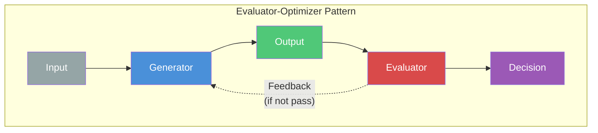
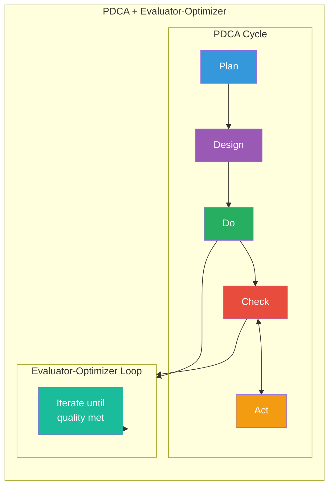

# Evaluator-Optimizer Pattern Skill

## Pattern Overview

The Evaluator-Optimizer pattern is one of five key agentic patterns identified by Anthropic for building effective AI systems. It creates a feedback loop between generation and evaluation to iteratively improve output quality.

## Pattern Architecture



## Key Components

### 1. Generator (생성기 / ジェネレータ / 生成器)

Creates initial output or applies improvements.

```markdown
Responsibilities:
- Generate initial implementation
- Apply fixes based on evaluator feedback
- Refactor code based on suggestions
- Create missing components

Tools Used:
- Write: Create new files
- Edit: Modify existing files
- Bash: Run generators, build tools
```

### 2. Evaluator (평가기 / 評価器 / 评估器)

Assesses output quality against defined criteria.

```markdown
Responsibilities:
- Analyze output against criteria
- Identify gaps and issues
- Score quality metrics
- Generate improvement suggestions

Evaluator Types:
1. Gap Evaluator (gap-detector)
   - Compares design vs implementation
   - Measures API/model/component match rate

2. Quality Evaluator (code-analyzer)
   - Checks code complexity
   - Finds security issues
   - Detects code smells

3. Functional Evaluator (qa-monitor)
   - Validates via log analysis
   - Checks error handling
   - Verifies expected behavior
```

### 3. Feedback Loop (피드백 루프 / フィードバックループ / 反馈循环)

Connects evaluator output to generator input.

```markdown
Feedback Content:
- List of issues found
- Priority ranking (Critical > Warning > Info)
- Specific file:line locations
- Suggested fixes
- Score improvement needed

Feedback Format:
{
  "iteration": 2,
  "score": 78,
  "target": 90,
  "issues": [
    {
      "type": "gap",
      "severity": "critical",
      "location": "src/api/auth.ts:45",
      "message": "Missing error handler for INVALID_TOKEN",
      "suggestion": "Add catch block with proper error response"
    }
  ]
}
```

### 4. Exit Criteria (종료 조건 / 終了条件 / 终止条件)

Determines when to stop iterating.

```markdown
Success Conditions:
- All quality thresholds met
- No critical issues remaining
- Score >= target percentage

Failure Conditions:
- Maximum iterations reached
- No improvement for N iterations
- Unfixable issues detected

Configurable Thresholds:
- gap_match_rate: 90% (default)
- quality_score: 80% (default)
- max_iterations: 5 (default)
- no_improvement_limit: 3 (default)
```

## Implementation Patterns

### Pattern 1: Simple Iteration

```markdown
Use Case: Single evaluator, straightforward fixes

Flow:
1. Generate initial output
2. Evaluate with single criteria
3. If fail, apply fix and re-evaluate
4. Repeat until pass or max iterations

Example:
- Code style fixes (linting)
- Type error corrections
- Simple refactoring
```

### Pattern 2: Multi-Evaluator Pipeline

```markdown
Use Case: Complex quality requirements

Flow:
1. Generate initial output
2. Run Evaluator 1 (gap analysis)
3. Run Evaluator 2 (quality check)
4. Run Evaluator 3 (functional test)
5. Aggregate scores and issues
6. Apply fixes prioritized by severity
7. Re-evaluate all

Example:
- Feature implementation
- API development
- Component creation
```

### Pattern 3: Staged Improvement

```markdown
Use Case: Large-scale improvements

Flow:
1. Stage 1: Fix critical issues only
2. Stage 2: Fix warning-level issues
3. Stage 3: Apply optimizations
4. Each stage has its own iteration limit

Example:
- Legacy code modernization
- Security hardening
- Performance optimization
```

## Integration with PDCA



## Evaluation Criteria Templates

### Gap Analysis Criteria

```yaml
criteria:
  api_endpoints:
    match_rate: 90%
    weight: 30%
  data_models:
    match_rate: 90%
    weight: 30%
  components:
    match_rate: 85%
    weight: 20%
  error_handling:
    coverage: 80%
    weight: 20%
```

### Quality Analysis Criteria

```yaml
criteria:
  security:
    critical_issues: 0
    weight: 40%
  complexity:
    max_per_function: 15
    weight: 20%
  duplication:
    max_lines: 10
    weight: 20%
  maintainability:
    score: 70
    weight: 20%
```

### Functional Analysis Criteria

```yaml
criteria:
  error_logs:
    count: 0
    weight: 40%
  success_logs:
    coverage: 100%
    weight: 30%
  response_time:
    p95_ms: 500
    weight: 30%
```

## Best Practices

### 1. Define Clear Criteria

```markdown
BAD:
  "Make the code better"

GOOD:
  "Reduce function complexity to <= 10"
  "Achieve 90% test coverage"
  "Fix all security issues with severity >= high"
```

### 2. Prioritize Issues

```markdown
Order of fixing:
1. Critical security vulnerabilities
2. Functional bugs (broken behavior)
3. Design-implementation gaps
4. Code quality issues
5. Performance optimizations
6. Style improvements
```

### 3. Limit Iteration Scope

```markdown
Per iteration, fix:
- Maximum 5 issues
- Only same-severity issues
- Related issues together

Rationale:
- Easier to verify improvements
- Faster feedback cycles
- Reduces regression risk
```

### 4. Track Progress

```markdown
Maintain iteration log:
- Score history
- Issues fixed per iteration
- Time per iteration
- Files modified

Use for:
- Detecting stuck iterations
- Identifying improvement trends
- Post-mortem analysis
```

## Troubleshooting

### Issue: No Improvement After Iterations

```markdown
Causes:
- Criteria too strict
- Issues require human judgment
- Circular dependencies

Solutions:
- Relax thresholds temporarily
- Mark issues as "requires-human"
- Break circular dependencies manually
```

### Issue: Oscillating Scores

```markdown
Causes:
- Fixes create new issues
- Conflicting criteria

Solutions:
- Apply fixes in isolation
- Prioritize criteria order
- Use staged improvement pattern
```

### Issue: Slow Iterations

```markdown
Causes:
- Too many files analyzed
- Complex evaluations
- Large codebase

Solutions:
- Scope to specific feature/folder
- Cache evaluation results
- Use incremental evaluation
```

## Related Patterns

```markdown
From Anthropic's Agent Patterns:
1. Prompt Chaining - Sequential processing
2. Routing - Direct to appropriate handler
3. Parallelization - Concurrent processing
4. Orchestrator-Workers - Task delegation
5. Evaluator-Optimizer - Quality iteration ← THIS PATTERN
```

## References

- Anthropic Agent Patterns Documentation
- bkit PDCA Methodology
- Code Quality Best Practices
